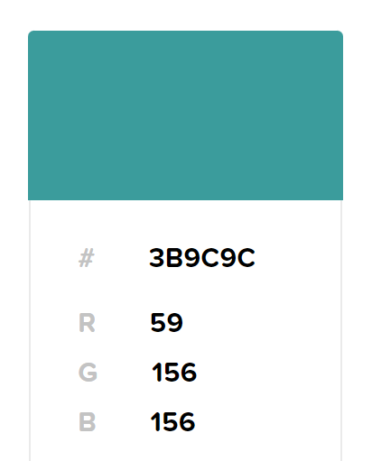
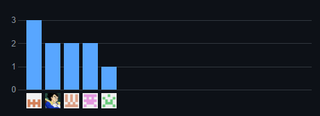
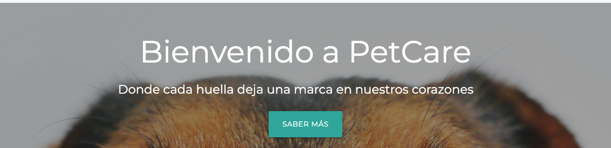
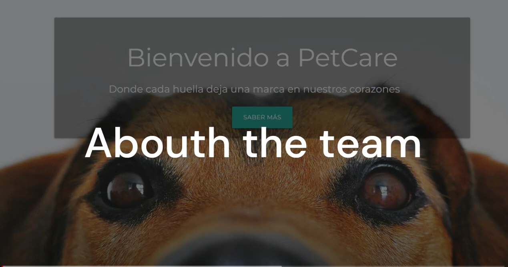

**Desarrollo de Aplicaciones Open Source  
Sección:** WX54

**Docente:** Alberto Wilmer Sanchez Seña

**Informe del TF**

**Nombre del Startup:** DeMentes

**Nombre del producto:** PetCare

**Junio 2024**

**Relación de integrantes:  
**Gianluca Santino Pasquale Barrenechea - U202112078  
Leonardo Jose Solis Solis - U20211G163  
Andrea Joselyn Garcia Moscoso - U201921060  
Katherine Maryory Mejia Aliaga - U20221A118  
Camila Alessandra Conde Isla - U202114309

Registro de versiones del informe

<table>
<colgroup>
<col style="width: 10%" />
<col style="width: 15%" />
<col style="width: 16%" />
<col style="width: 57%" />
</colgroup>
<thead>
<tr class="header">
<th>Versión</th>
<th>Fecha</th>
<th>Autor</th>
<th>Descripción de modificación</th>
</tr>
<tr class="odd">
<th>TB1</th>
<th>12/04/2024</th>
<th>
Pasquale Barrenechea, Gianluca Santino

Solis Solis, Leonardo Jose

Garcia Moscoso, Joselyn

Andrea

Mejia Aliaga, Katherine Maryory

Conde Isla, Camila Alessandra
</th>
<th>
Se realizaron los Capítulos I: Introducción, Capítulo II:
Requirements Elicitation &amp; Analysis, Capítulo

III: Requirements Specification y Capítulo IV: Product
Design
</th>
</tr>
<tr class="header">
<th>TP</th>
<th>01/05/24</th>
<th>
Pasquale Barrenechea, Gianluca Santino

Solis Solis, Leonardo Jose

Garcia Moscoso, Andrea Joselyn

Mejia Aliaga, Katherine Maryory

Conde Isla, Camila Alessandra
</th>
<th>
Se realizaron los puntos del Capítulo V: Sprint 2, Sprint
Planning 2, Sprint Backlog 2, Development

Evidence for Sprint Review, Testing Suite Evidence for Sprint Review,
Execution Evidence for Sprint

Review, Services Documentation Evidence for Sprint Review, Software
Deployment Evidence for

Sprint Review y Team Collaboration Insights during Sprint
</th>
</tr>
<tr class="odd">
<th>TB2</th>
<th></th>
<th>
Pasquale Barrenechea, Gianluca Santino

Solis Solis, Leonardo Jose

Garcia Moscoso, Andrea Joselyn

Mejia Aliaga, Katherine Maryory

Conde Isla, Camila Alessandra
</th>
<th>Se realizaron los puntos del Capítulo V: Sprint 3, Sprint Planning
3, Sprint Backlog 3, Development Evidence for Sprint Review, Testing
Suite Evidence for Sprint Review, Execution Evidence for Sprint Review,
Services Documentation Evidence for Sprint Review, Software Deployment
Evidence for Sprint Review, Team Collaboration Insights during Sprint,
Diseño de Entrevistas, Registro de Entrevistas, Evaluaciones según
heurísticas, Video About-the-Product, Video About-the-Team</th>
</tr>
<tr class="header">
<th>TF</th>
<th>24/06/24</th>
<th>
Pasquale Barrenechea, Gianluca Santino

Solis Solis, Leonardo Jose

Garcia Moscoso, Andrea Joselyn

Mejia Aliaga, Katherine Maryory

Conde Isla, Camila Alessandra
</th>
<th>Se realizaron los puntos del Capítulo V: Sprint 4, Sprint Planning
4, Sprint Backlog 4, Development Evidence for Sprint Review, Testing
Suite Evidence for Sprint Review, Execution Evidence for Sprint Review,
Services Documentation Evidence for Sprint Review, Software Deployment
Evidence for Sprint Review, Team Collaboration Insights during
Sprint.</th>
</tr>
</thead>
<tbody>
</tbody>
</table>

Project Report Collaboration Insights

- **TB1**: Para esta entrega, realizamos como equipo las actividades
  correspondientes a los capítulos asignados en el siguiente repositorio
  dentro de

nuestra organización de grupo:

Link del repositorio del Informe Final: [<u>Github - Informe final
PetCare</u>](https://github.com/DeMentes1/PetCare_LandingPage)

> A continuación, se muestran las capturas de evidencia correspondientes
> al desarrollo de los siguientes capítulos:
>
> Capítulo I: Introducción
>
> Capítulo II: Requirements Elicitation & Analysis
>
> Capítulo III: Requirements Specification
>
> Capítulo IV: Product Design
>
> Capítulo V: Product Implementation, Validation & Deployment

- **TP1**: Para esta entrega, realizamos como equipo las actividades
  correspondientes al capítulo asignado en el siguiente repositorio
  dentro de nuestra organización de grupo:

> Link del repositorio del Informe Final: [<u>Github - Informe final
> PetCare</u>](https://github.com/DeMentes1/PetCare_LandingPage)
>
> A continuación, se muestran las capturas de evidencia correspondientes
> al desarrollo de los siguientes puntos:
>
> Sprint 2
>
> Sprint Planning 2
>
> Sprint Backlog 2
>
> Development Evidence for Sprint Review
>
> Testing Suite Evidence for Sprint Review
>
> Execution Evidence for Sprint Review
>
> Services Documentation Evidence for Sprint Review
>
> Software Deployment Evidence for Sprint Review
>
> Team Collaboration Insights during Sprint

- **TB2**: Para esta entrega, realizamos como equipo las actividades
  correspondientes al capítulo asignado en el siguiente repositorio
  dentro de nuestra organización de grupo:

> Link del repositorio del Informe Final: [<u>Github - Informe final
> PetCare</u>](https://github.com/DeMentes1/PetCare_LandingPage)
>
> A continuación, se muestran las capturas de evidencia correspondientes
> al desarrollo de los siguientes puntos:
>
> Sprint 3
>
> Sprint Planning 3
>
> Sprint Backlog 3
>
> Development Evidence for Sprint Review
>
> Testing Suite Evidence for Sprint Review
>
> Execution Evidence for Sprint Review
>
> Services Documentation Evidence for Sprint Review
>
> Software Deployment Evidence for Sprint Review
>
> Team Collaboration Insights during Sprint
>
> Diseño de Entrevistas
>
> Registro de Entrevistas
>
> Evaluaciones según heurísticas
>
> Video About-the-Product
>
> Video About-the-Team

TF1: Para esta entrega, realizamos como equipo las actividades
correspondientes al capítulo asignado en el siguiente repositorio dentro
de

Nuestra organización de grupo:

Link del repositorio del Informe Final: Github - Informe Final GreenGrow

A continuación, se muestran las capturas de evidencia correspondientes
al desarrollo de los siguientes puntos:

Sprint 4

Sprint Planning 4

Sprint Backlog 4

Development Evidence for Sprint Review

Testing Suite Evidence for Sprint Review

Execution Evidence for Sprint Review

Services Documentation Evidence for Sprint Review

Software Deployment Evidence for Sprint Review

Team Collaboration Insights during Sprint

Contenido

[CAPÍTULO I: Introducción 16](#capítulo-i-introducción)

> [1.1. Startup Profile 16](#startup-profile)
>
> [1.1.1. Descripción de la Startup 16](#descripción-de-la-startup)
>
> [1.1.2. Perfiles de integrantes del equipo
> 17](#perfiles-de-integrantes-del-equipo)
>
> [1.2. Solution Profile 18](#solution-profile)
>
> [1.2.1 Antecedentes y problemática 19](#antecedentes-y-problemática)
>
> [1.2.2 Lean UX Process. 20](#lean-ux-process.)
>
> [1.2.2.1. Lean UX Problem Statements 20](#lean-ux-problem-statements)
>
> [1.2.2.2. Lean UX Assumptions 20](#lean-ux-assumptions)
>
> [1.2.2.3. Lean UX Hypothesis Statements
> 22](#lean-ux-hypothesis-statements)
>
> [1.2.2.4. Lean UX Canvas 23](#lean-ux-canvas)
>
> [1.3. Segmentos objetivo 25](#segmentos-objetivo)

[Capítulo II: Requirements Elicitation & Analysis
27](#capítulo-ii-requirements-elicitation-analysis)

> [2.1. Competidores 27](#competidores)
>
> [2.1.1. Análisis competitivo 27](#análisis-competitivo)
>
> [2.1.2. Estrategias y tácticas frente a competidores
> 29](#estrategias-y-tácticas-frente-a-competidores)
>
> [2.2. Entrevistas 30](#entrevistas)
>
> [2.2.1. Diseño de entrevistas 30](#diseño-de-entrevistas)
>
> [2.2.2. Registro de entrevistas. 32](#registro-de-entrevistas.)
>
> [2.2.3. Análisis de entrevistas. 36](#análisis-de-entrevistas.)
>
> [2.3. Needfinding 37](#needfinding)
>
> [2.3.1. User Personas 37](#user-personas)
>
> [2.3.2. User Task Matrix 39](#user-task-matrix)
>
> [2.3.3. User Journey Mapping. 41](#user-journey-mapping.)
>
> [2.3.4. Empathy Mapping. 43](#empathy-mapping.)
>
> [2.3.5. As-is Scenario Mapping. 44](#as-is-scenario-mapping.)
>
> [2.4. Ubiquitous Language. 44](#ubiquitous-language.)

[Capítulo III: Requirements Specification
46](#capítulo-iii-requirements-specification)

> [3.1. To-Be Scenario Mapping 46](#to-be-scenario-mapping)
>
> [3.2. User Stories 47](#user-stories)
>
> [Technical User Stories 52](#technical-user-stories)
>
> [3.3. Impact Mapping 57](#impact-mapping)
>
> [3.4. Product Backlog 59](#product-backlog)

[Capítulo IV: Product Design 60](#capítulo-iv-product-design)

> [4.1. Style Guidelines 60](#style-guidelines)
>
> [4.1.1. General Style Guidelines 60](#general-style-guidelines)
>
> [4.1.2. Web Style Guidelines 62](#web-style-guidelines)
>
> [4.2. Information Architecture 63](#information-architecture)
>
> [4.2.1. Organization Systems 63](#organization-systems)
>
> [4.2.2. Labeling Systems. 63](#labeling-systems.)
>
> [4.2.3. SEO Tags and Meta Tags 64](#seo-tags-and-meta-tags)
>
> [4.2.4. Searching Systems 64](#searching-systems)
>
> [4.2.5. Navigation Systems 65](#navigation-systems)
>
> [4.3. Landing Page UI Design 65](#landing-page-ui-design)
>
> [4.3.1. Landing Page Wireframe 65](#landing-page-wireframe)
>
> [4.3.2. Landing Page Mock-up. 6/34 V1.0
> 69](#landing-page-mock-up.-634-v1.0)
>
> [4.4. Web Applications UX/UI Design 72](#web-applications-uxui-design)
>
> [4.4.1. Web Applications Wireframes 72](#web-applications-wireframes)
>
> [4.4.2. Web Applications Wireflow Diagrams
> 80](#web-applications-wireflow-diagrams)
>
> [4.4.3. Web Applications Mock-ups 81](#web-applications-mock-ups)
>
> [4.4.4. Web Applications User Flow Diagrams
> 87](#web-applications-user-flow-diagrams)
>
> [4.5. Web Applications Prototyping 90](#web-applications-prototyping)
>
> [4.6. Domain-Driven Software Architecture
> 90](#domain-driven-software-architecture)
>
> [4.6.1. Software Architecture Context Diagram
> 91](#software-architecture-context-diagram)
>
> [4.6.2. Software Architecture Container Diagrams.
> 91](#software-architecture-container-diagrams)
>
> [4.6.3. Software Architecture Components Diagrams.
> 92](#software-architecture-components-diagrams.)
>
> [4.7. Software Object-Oriented Design.
> 96](#software-object-oriented-design.)
>
> [4.7.1. Class Diagrams. 96](#class-diagrams.)
>
> [4.7.2. Class Dictionary. 96](#class-dictionary.)
>
> [4.8. Database Design 98](#database-design)
>
> [4.8.1. Database Diagram 98](#database-diagram)

[Capítulo V: Product Implementation, Validation & Deployment.
98](#capítulo-v-product-implementation-validation-deployment.)

> [5.1. Software Configuration Management.
> 98](#software-configuration-management.)
>
> [5.1.1. Software Development Environment Configuration.
> 98](#software-development-environment-configuration.)
>
> [5.1.2. Source Code Management. 100](#source-code-management.)
>
> [5.1.3. Source Code Style Guide & Conventions.
> 100](#source-code-style-guide-conventions.)
>
> [5.1.4. Software Deployment Configuration.
> 101](#software-deployment-configuration.)
>
> [5.2. Landing Page, Services & Applications Implementation.
> 101](#landing-page-services-applications-implementation.)
>
> [5.2.1. Sprint 1 101](#sprint-1)
>
> [5.2.1.1. Sprint Planning 1. 101](#sprint-planning-1.)
>
> [5.2.1.2. Sprint Backlog 1. 103](#sprint-backlog-1.)
>
> [5.2.1.3. Development Evidence for Sprint Review.
> 104](#development-evidence-for-sprint-review.)
>
> [5.2.1.4. Testing Suite Evidence for Sprint Review.
> 105](#testing-suite-evidence-for-sprint-review.)
>
> [5.2.1.5. Execution Evidence for Sprint Review
> 105](#execution-evidence-for-sprint-review)
>
> [5.2.1.6. Services Documentation Evidence for Sprint Review
> 105](#services-documentation-evidence-for-sprint-review)
>
> [5.2.1.7. Software Deployment Evidence for Sprint Review.
> 106](#software-deployment-evidence-for-sprint-review.)
>
> [5.2.1.8. Team Collaboration Insights during Sprint.
> 106](#team-collaboration-insights-during-sprint.)
>
> [5.2.2. Sprint 2 106](#sprint-2)
>
> [5.2.2.1. Sprint Planning 2. 106](#sprint-planning-2.)
>
> [5.2.2.2. Sprint Backlog 2. 107](#sprint-backlog-2.)
>
> [5.2.2.3. Development Evidence for Sprint Review.
> 108](#development-evidence-for-sprint-review.-1)
>
> [5.2.2.4. Testing Suite Evidence for Sprint Review.
> 109](#testing-suite-evidence-for-sprint-review.-1)
>
> [5.2.2.5. Execution Evidence for Sprint Review.
> 109](#execution-evidence-for-sprint-review.)
>
> [5.2.2.6. Services Documentation Evidence for Sprint Review.
> 110](#services-documentation-evidence-for-sprint-review.)
>
> [5.2.2.7. Software Deployment Evidence for Sprint Review
> 111](#software-deployment-evidence-for-sprint-review)
>
> [5.2.2.8. Team Collaboration Insights during Sprint
> 111](#team-collaboration-insights-during-sprint)
>
> [5.3. Validation Interviews 115](#validation-interviews)
>
> [5.3.1. Diseño de Entrevistas 115](#diseño-de-entrevistas-1)
>
> [5.3.2. Registro de Entrevistas 119](#registro-de-entrevistas)
>
> [5.3.3. Evaluaciones según heurísticas
> 124](#evaluaciones-según-heurísticas)
>
> [5.4. Video About-the-Product 134](#video-about-the-product)
>
> [5.5. Video About-the-Team 135](#video-about-the-team)

[Avance de Conclusiones, Bibliografía y Anexos.
135](#avance-de-conclusiones-bibliografía-y-anexos.)

> [Bibliografía: 135](#bibliografía)
>
> [Conclusiones: 135](#conclusiones)
>
> [Anexos 137](#anexos)

Student Outcome

<table>
<colgroup>
<col style="width: 32%" />
<col style="width: 41%" />
<col style="width: 26%" />
</colgroup>
<thead>
<tr class="header">
<th>Criterio específico</th>
<th>Acciones Realizadas</th>
<th>Conclusiones</th>
</tr>
<tr class="odd">
<th>
Comunica oralmente sus ideas

y/o resultados con objetividad a

público de diferentes

especialidades y niveles

jerárquicos, en el marco del

desarrollo de un proyecto en

ingeniería.
</th>
<th>
<strong>Gianluca Pasquale</strong>

TB1 
Se realizó el desarrollo de la descripción detallada de los User Stories
y criterios de aceptación, asegurando una comprensión clara de los
requerimientos. 
TP 
Se realizó el desarrollo detallado de las Épicas, junto a las
correcciones del Lean UX para un mejor entendimiento de nuestro
proyecto.

TB2 
Durante la presentación del desarrollo del front end de la aplicación
con Angular, detallé cómo se diseñarán los perfiles de usuario y el
soporte al cliente, asegurando que los procesos sean comunicados de
manera clara y objetiva para proporcionar una experiencia de usuario
óptima y eficiente. Este diseño se llevará a cabo mediante reuniones
periódicas para definir y acordar los aspectos esenciales. Además, al
presentar la primera versión del backend, resalté objetivamente sus
funcionalidades principales, así como el desarrollo y funcionamiento de
los formularios correspondientes.

Camila Conde 
TB1 
Se realizaron los mapeos principales para identificar lo que el usuario
podía pensar o necesitar, según la empatía.

TP

Se realizaron las technical stories relacionadas a la aplicación
tomando en cuenta las ideas de los demás miembros de grupo, además se
desarrolló las pantallas de pago.

TB2

Por medio de las entrevistas que se realizaron se buscó opiniones
diversas de los entrevistados, aceptando cada una como críticas
constructivas.

<strong>Andrea Garcia</strong> 
TB1 
Se llevó a cabo un análisis exhaustivo de los segmentos objetivos de
nuestra problemática, identificando sus necesidades y expectativas
mediante entrevistas. Presenté los resultados de manera clara y
objetiva, utilizando herramientas visuales para facilitar la
comprensión.

TP 
Se realizó el desarrollo del frontend de la aplicación, se realizaron
reuniones para acordar la definición de los bounded context de la
aplicación para una arquitectura clara y modular. Además, se acordaron
las bases para el desarrollo del modelo C4, asegurando una comunicación
clara y efectiva de la estructura.

TB2 
Durante la presentación del desarrollo de responsive design en el
frontend de la aplicación con Angular, comuniqué de manera objetiva los
procesos para garantizar una experiencia de usuario óptima en diversos
dispositivos. Este desarrollo se realizó mediante reuniones periódicas
para acordar estos aspectos clave. Además, al presentar la primera
versión del backend, destaqué objetivamente sus funcionalidades
clave.

TF

Durante la implementación de los diagramas de C4, comuniqué de manera
objetiva los procesos para garantizar una mejor experiencia al usuario.
Este desarrollo se realizó mediante reuniones para acordar estos
aspectos clave. Se mejoró la última versión del backend y del frontend.
Además, destacó objetivamente sus funcionalidades.

<strong>Katherine Mejia</strong> 
TB1 
Se examinaron las entidades relacionadas con el tema de nuestro
proyecto. También se propusieron diversas soluciones en línea con
nuestro curso para lograr un resultado final.

TP

TB2

Se hicieron las correcciones de los diagramas de clase para que vaya
acorde con nuestros segmentos objetivos y proyecto en general.

<strong>Leonardo Solis</strong> 
TB1 
Se llevó a cabo una propuesta de desarrollo del proyecto mediante
wireframes y mockups desarrollados en Figma que de manera tangible y
funcional facilitaron la comprensión del producto final para el equipo
técnico así como también para los interesados.

TP

Se realizó el avance con el desarrollo frontend del proyecto,
mediante las reuniones pude determinar la manera de organizar el
proyecto usando la architectura de en capas del diseño Domain Driven,
asi como tambien ayudar al equipo con la organización del código fuente
en Github con la aplicación de Git Flow y Conventional Commits.

TB2

Durante la presentación del desarrollo de la nueva versión del
front-end application, destaque los atributos ARIA y la importancia que
tienen estos para la accesibilidad de nuestra aplicación hacia personas
con discapacidades.

TF

Durante la presentación del web services application, destaque la
importancia del bounded context de payment para la funcionalidad de la
aplicación, brindando detalles esenciales para los usuarios que quieran
seguir sus transacciones.
</th>
<th>
TB1 
Durante el trabajo inicial en el proyecto, nos enfocamos en el
desarrollo y la clarificación de los User Stories y sus criterios de
aceptación. Este proceso garantizó una comprensión clara y detallada de
los requisitos del proyecto para todo el equipo, sentando una base
sólida para el desarrollo posterior.

TP

Realizamos nuestro despliegue del Frontend en base al proyecto
planteado.

TB2

TF

Realizamos el diagrama de clases, diagrama de base de datos,
responsive en el frontend, el backend en web services
application.
</th>
</tr>
<tr class="header">
<th>
Comunica en forma escrita ideas

y/o resultados con objetividad a

público de diferentes

especialidades y niveles

jerárquicos, en el marco del

desarrollo de un proyecto en

ingeniería.
</th>
<th>
Gianluca Pasquale 
TB1 
Se desarrolló la definición de los cambios necesarios para mejorar la
eficiencia operativa y la comunicación con los clientes en el escenario
futuro.

TP 
Se desarrollaron las pantallas funcionales del Profile y Support para el
cliente en el Landing Page, para así poder analizar la satisfacción del
cliente en nuestra plataforma digital.

TB2 
Desarrollé el diseño de perfiles de usuario y soporte al cliente en el
frontend de la aplicación utilizando el framework Angular, garantizando
una experiencia de usuario óptima y eficiente. Presenté una primera
versión del backend, destacando su integración, funcionalidades clave y
el correcto funcionamiento de los formularios correspondientes.

Camila Conde 
TB1 
Se identificó los requerimientos de los usuarios para una mejor
experiencia y satisfacción de necesidades.

TP

Para esta entrega se evidencia una mejora continua al investigar más
sobre la problemática.

TB2

Se realizaron entrevistas de validación de los usuarios sobre la
aplicación y el landing page además de correcciones en las technical
stories.

TF

Se realizó un bounded context con sus respectivos endpoint, también
se corrigieron las technical stories y el diagrama de clases.

Andrea Garcia 
TB1 
Durante la presentación de la investigación sobre las necesidades del
usuario y del prototipo desarrollado, comuniqué de manera objetiva las
soluciones propuestas.

TP 
Se realizó el desarrollo del frontend de la aplicación utilizando el
framework Angular, implementando bounded context para una arquitectura
clara y modular. Además, desarrollé el modelo C4, asegurando una
comunicación clara y efectiva de la estructura y componentes del
sistema.

TB2 
Desarrollé un diseño responsive en el frontend de la aplicación
utilizando el framework Angular, asegurando una experiencia de usuario
óptima en diferentes dispositivos. Presenté una primera versión del
backend, destacando su integración y funcionalidades clave.

TF 
Desarrollé los endpoints de la aplicación usando Spring Boot para poder
inicializarlo con Java, destacando su integración y funcionalidades
clave.

Asegurando una experiencia de usuario óptima en diferentes
dispositivos.

Katherine Mejia 
TB1 
Se elaboró un informe que abarcaba varios aspectos clave para el
desarrollo del proyecto, que iban desde la investigación de la
problemática hasta la creación de algunos prototipos de solución.

TP

Se desarrollaron las pantallas de Reserva de - Citas, historial de
citas y confirmación de pagos para poder ofrecerle una experiencia
agradable al usuario.

Leonardo Solis 
TB1

Me encargue de implementar y modelar los wireframes y mockups
utilizando Figma, así como también modelar el prototipo funcional de la
aplicación para una mejor comprensión.

TP

Desarrolle las pantallas de Login, Register y Shop utilizando el
framework Angular y Angular Material. A través de estas tecnologías,
diseñé e implementé interfaces de usuario eficientes y funcionales que
cumplían con los requisitos del proyecto. Los wireframes y mockups
iniciales creados con Figma fueron fundamentales para guiar el proceso
de desarrollo y asegurar que el diseño final fuera coherente y fácil de
usar. Estas pantallas clave permitieron una experiencia de usuario
intuitiva y efectiva, cumpliendo con las expectativas tanto del equipo
técnico como de los interesados no técnicos.

TB2

Aplique responsive web design y ARIA attributes a mis pantallas
desarrolladas de Login, Register y Shop, así como también implemente el
funcionamiento de una fake-api para una mejor presentación en el
despliegue esta versión de la aplicación web.

TF

Diseñe el context de Payment para el web services application,
implementando su funcionamiento de comunicacion con la base de datos y
la prueba de HTTP requests mediante la UI de Swagger
</th>
<th>
TB1 
Durante este período, se avanzó significativamente en el proyecto al
definir cambios para mejorar la eficiencia operativa y la comunicación
con los clientes. Además, se realizó una investigación exhaustiva sobre
las necesidades del usuario y se creó un prototipo de solución. Estos
esfuerzos combinados sentaron las bases para un desarrollo futuro
exitoso del proyecto.

TP

Se realizó la primera versión del Frontend y mejora del Landing Page
y deployment del Frontend con el framework de Angular.

TB2

Se realizó la primera versión del Backend web services application,
deploy de la web services application y la evaluación para
heurísticas.

TF

Para la entrega final nos concentramos en mejorar nuestro landing
page, frontend y mostrar los endpoints que se conectaría al frontend.
Además de asegurarnos de deployar cada parte de nuestro
proyecto.
</th>
</tr>
</thead>
<tbody>
</tbody>
</table>

# CAPÍTULO I: Introducción

## 1.1. Startup Profile

En esta sección desarrollaremos la descripción de la startup y los
perfiles de los miembros del equipo.

### 1.1.1. Descripción de la Startup

Petcare, es un sitio web que contará con su landing page, donde
permitirá a los usuarios agendar citas médicas de baño o de algún otro
servicio que ofrecen las veterinarias registradas. Nuestro primer
segmento objetivo son los dueños de las mascotas que deseen buscar una
facilidad y eficiencia al requerir servicios médicos veterinarios, el
segundo son los centros veterinarios que busquen ampliar su negocio. El
modelo de negocio que seguiremos será el de suscripción.

### **1.1.2. Perfiles de integrantes del equipo**

Gianluca Pasquale - U202112078 - Ing. de Software

Soy Gianluca Pasquale, estudiante de Ingeniería de Software, con
experiencia en programación y como técnico de computadoras. Ofrezco
habilidades técnicas en desarrollo de software y solución de problemas

Leonardo Solis - U20211G163 - Ing. de
Software

Soy Leonardo Solis, desde pequeño me gustan los videojuegos y esto a su
vez me llevó a investigar cómo estaban hechos, descubriendo la
programación e impulsando a seguir investigando más acerca de este
mundo.

Andrea Garcia - U201921060 - Ing. de
Software

> Actualmente estoy cursando el quinto ciclo de mi carrera. Elegí esta
> carrera debido a que desde la niñez me interesó el cómo funcionan las
> computadoras por dentro. Poseo conocimiento en programación
> estructurada y POO. Además, tengo habilidades en el trabajo en equipo
> y trabajo en tareas múltiples.

Camila Conde - u202114309 - Ing. de
Software

Soy estudiante de la carrera de Ingeniería de Software en la cual me
encuentro cursando el quinto ciclo de la carrera. Mi motivación para
seguir aprendiendo es llegar a crear y diseñar soluciones creativas. Me
considero una persona creativa, proactiva, tolerante, respetuosa y
apasionada por lo que me gusta. Me comprometo a apoyar en el proceso
para poder tener un proyecto final bien planteado para obtener una buena
nota.

Katherine Maryory Mejia Aliaga - U20221A118- Ing. de
Software

> Me encuentro en el quinto ciclo de la carrera de
>
> Ingeniería de Software. Tengo conocimientos en
>
> C++, Phyton y HTML. Me gusta trabajar en equipo
>
> y a la vez sacar lo mejor de mis compañeros para hacer un
>
> buen trabajo. Además, tengo capacidad y aptitud
>
> para generar nuevas e innovadoras ideas y siempre
>
> estoy dispuesta a adquirir nuevas habilidades y
>
> conocimientos.

## 1.2. Solution Profile

En esta sección desarrollaremos dos partes: la primera parte,
Antecedentes y Problemática, y la segunda parte, Lean UX Process.

### **1.2.1 Antecedentes y problemática**

- Who  
  Usuarios objetivo: Dueños de mascotas que buscan facilitar la búsqueda
  y reserva de servicios médicos veterinarios. También, centros
  veterinarios interesados en ampliar su clientela y servicios.

- What  
  El problema es que los usuarios experimentan dificultades para
  encontrar citas médicas disponibles de manera rápida y conveniente, lo
  que provoca una disminución en la satisfacción del cliente y afecta la
  eficiencia operativa de las clínicas veterinarias.

<!-- -->

- Where  
  La problemática de nuestro proyecto PetCare se suscita dentro de las
  clínicas veterinarias en Lima Metropolitana.

- When  
  Los usuarios experimentan dificultades para encontrar citas médicas
  disponibles de manera rápida y conveniente cuando intentan agendarlas
  a través de métodos tradicionales, como llamadas telefónicas o visitas
  personales a las clínicas veterinarias.

<!-- -->

- Why  
  Esto sucede debido a la falta de sistemas de gestión de citas
  eficientes y la dependencia de métodos manuales para programar citas,
  lo que resulta en largos tiempos de espera, citas superpuestas y
  dificultad para acceder a la información sobre disponibilidad de
  citas. Además, la falta de acceso fácil a información detallada sobre
  los servicios ofrecidos y los precios también contribuye a la
  dificultad de encontrar citas médicas disponibles de manera rápida y
  conveniente.

<!-- -->

- How  
  La problemática de nuestro proyecto PetCare se materializa debido a la
  falta de sistemas de gestión de citas eficientes en las clínicas
  veterinarias de Lima Metropolitana.

<!-- -->

- How Much  
  La problemática de nuestro proyecto PetCare afecta a una gran cantidad
  de usuarios y clínicas veterinarias en Lima Metropolitana, lo que
  representa un desafío significativo en el acceso a citas médicas para
  las mascotas. Según datos recientes, en lo que respecta al cuidado de
  la salud de los perros, aproximadamente el 25% de los propietarios
  manifiesta nunca llevarlos al médico, siendo esta cifra aún mayor en
  el interior del Perú Urbano, alcanzando un 34%. Por otro lado, en el
  caso de los gatos, un alarmante 59% de los propietarios menciona no
  brindarles atención médica en absoluto (CPI, 2018). Estas estadísticas
  resaltan la urgente necesidad de mejorar el acceso a servicios
  veterinarios en Lima Metropolitana, donde PetCare busca desempeñar un
  papel fundamental en la facilitación de citas médicas para las
  mascotas.

### **1.2.2 Lean UX Process.**

#### 1.2.2.1. Lean UX Problem Statements

Nuestro proyecto en desarrollo busca facilitar la búsqueda y reserva de
servicios veterinarios, proporcionando conveniencia y eficiencia a los
usuarios, y mejorando la comunicación entre los dueños de mascotas y las
clínicas veterinarias. Hemos observado que un factor crítico que podría
afectar la satisfacción del cliente es la rapidez y conveniencia para
encontrar citas médicas disponibles. Actualmente, estamos notando que
los usuarios experimentan dificultades en este aspecto, lo que podría
disminuir la satisfacción del cliente y afectar la eficiencia operativa
de las clínicas veterinarias. ¿Cómo podemos mejorar la eficacia de
nuestros productos de comunicación en desarrollo, logrando que los
dueños de mascotas encuentren citas médicas disponibles de manera rápida
y conveniente, y que las clínicas veterinarias sean más eficientes en su
operativa?

#### 1.2.2.2. Lean UX Assumptions

Supuestos del negocio:

- Creo que mis clientes tienen la necesidad de: Encontrar y programar
  citas veterinarias de manera conveniente y eficiente.

- Estas necesidades pueden ser resueltas con: Una plataforma digital
  fácil de usar que permite buscar y reservar citas veterinarias.

- Mis clientes iniciales son (o serán): dueños de mascotas en áreas
  urbanas que valoran la conveniencia y el acceso rápido a servicios
  veterinarios.

- El valor principal que un cliente desea obtener de mi servicio es:
  Acceso conveniente y oportuno a la atención veterinaria para sus
  mascotas. También pueden obtener estos beneficios adicionales: Acceso
  a información sobre diferentes clínicas veterinarias, opiniones de
  otros propietarios de mascotas y recordatorios para citas futuras.

- Adquiriré la mayoría de mis clientes a través de: Campañas de
  marketing en línea, asociaciones con negocios relacionados con
  mascotas y publicidad por redes.

- Ganaré dinero mediante: Cobrar una tarifa de suscripción a las
  clínicas veterinarias por el uso de nuestra plataforma digital y de
  igual manera ofrecer funciones premium a los propietarios de mascotas.

- Mi principal competencia en el mercado será: Plataformas existentes de
  programación de citas veterinarias y métodos tradicionales de reserva
  de citas (llamadas telefónicas, visitas en persona). Los superaremos
  debido a: Ofrecer una interfaz más fácil de usar, funciones
  adicionales como recordatorios automáticos y una red más amplia de
  clínicas veterinarias participantes.

- Mi mayor riesgo del producto es: La adopción y retención del usuario.
  Resolveremos esto mediante: Mejoras continuas basadas en comentarios
  de usuarios, estrategias de marketing dirigidas y un servicio al
  cliente excepcional.

- ¿Qué otros supuestos tenemos que, de ser falsos, causarían que nuestro
  negocio/proyecto fracase? Supuestos sobre la disposición de las
  clínicas veterinarias para adoptar nuestra plataforma, la
  confiabilidad de nuestra infraestructura tecnológica y la
  escalabilidad de nuestro modelo de negocio.

Supuestos del usuario:

- ¿Quién es el usuario? Dueños de mascotas responsables de programar y
  gestionar citas veterinarias para sus mascotas, y también las clínicas
  veterinarias.

- ¿Dónde encaja nuestro producto en su trabajo o vida? Nuestro producto
  se integra en su vida diaria al proporcionar una manera conveniente de
  acceder y gestionar la atención veterinaria para sus mascotas.

- ¿Qué problemas resuelve nuestro producto? Resuelve el problema de la
  dificultad para encontrar y programar citas veterinarias de manera
  rápida y fácil.

- ¿Cuándo y cómo se usa nuestro producto? Nuestro producto se usa cada
  vez que un dueño de mascota necesita programar una cita veterinaria,
  típicamente durante su tiempo libre utilizando un teléfono inteligente
  o computadora.

- ¿Qué características son importantes? Las características importantes
  incluyen una interfaz fácil de usar, funcionalidad de búsqueda para
  encontrar clínicas veterinarias cercanas, programación de citas,
  recordatorios de citas y acceso a información y opiniones sobre las
  clínicas.

- ¿Cómo debería verse y comportarse nuestro producto? Nuestro producto
  debe tener un diseño limpio e intuitivo, con una navegación clara y
  características fáciles de usar que hagan que la programación y
  gestión de citas veterinarias sean sencillas para el usuario.

#### 1.2.2.3. Lean UX Hypothesis Statements

Creemos que al ofrecer un sistema de reserva de citas veterinarias más
eficiente y conveniente a través de nuestra plataforma digital,
aumentaremos la frecuencia de uso de la aplicación por parte de los
usuarios. Sabremos que estamos en lo correcto cuando observemos un
aumento significativo en el número de reservas de citas y una
disminución en las quejas relacionadas con la dificultad para programar
citas.

Creemos que al proporcionar características premium, como recordatorios
de citas automatizados y seguimiento de historiales médicos,
aumentaremos la satisfacción del usuario y su disposición a pagar por
servicios adicionales. Sabremos que estamos en lo correcto si observamos
un aumento en las suscripciones premium y una mejora en las
calificaciones de satisfacción del usuario.

Creemos que al establecer asociaciones estratégicas con un número
significativo de clínicas veterinarias locales, aumentaremos la variedad
y disponibilidad de servicios para los usuarios, lo que conducirá a una
mayor retención de usuarios y fidelidad a nuestra plataforma. Sabremos
que estamos en lo correcto si vemos un aumento en el número de clínicas
registradas en nuestra plataforma y un aumento en el número de usuarios
que realizan reservas de citas en estas clínicas.

#### 1.2.2.4. Lean UX Canvas

<table>
<colgroup>
<col style="width: 33%" />
<col style="width: 33%" />
<col style="width: 33%" />
</colgroup>
<thead>
<tr class="header">
<th>
<strong>Business Problem</strong>

El problema comercial que intentamos resolver es la dificultad que
enfrentan los usuarios para encontrar y reservar citas médicas
veterinarias de manera rápida y conveniente. Actualmente, las clínicas
veterinarias tradicionales utilizan métodos de reserva de citas manuales
o poco eficientes, lo que resulta en largos tiempos de espera y una
experiencia frustrante para los clientes
</th>
<th rowspan="2">
<strong>Solutions</strong>

Identificamos las siguientes ideas para soluciones que pueden
resolver nuestro problema comercial y satisfacer las necesidades de
nuestros clientes:

<ul>
<li>
Plataforma digital para agendar citas veterinarias: Desarrollar
un plataforma fácil de usar que permita a los usuarios buscar, programar
y administrar citas veterinarias desde sus dispositivos.
</li>
<li>
Recordatorios de citas automáticos: Implementar un sistema de
recordatorios automatizados para asegurarse de que los usuarios no
olviden sus citas médicas veterinarias.
</li>
<li>
Perfiles de mascotas personalizados: Permitir a los usuarios
crear perfiles personalizados para sus mascotas, donde puedan almacenar
información médica, recibir recomendaciones personalizadas y hacer un
seguimiento del historial de salud.
</li>
<li>
Servicios de telemedicina veterinaria: Ofrecer consultas
veterinarias virtuales para casos menos urgentes, lo que brinda a los
usuarios una opción conveniente y rápida para obtener asesoramiento
médico para sus mascotas.
</li>
<li>
Integración con tiendas de productos para mascotas: Establecer
asociaciones con tiendas de productos para mascotas para ofrecer la
posibilidad de comprar productos recomendados directamente a través de
la plataforma.
</li>
<li>
Programas de fidelización para usuarios frecuentes: Implementar
un programa de recompensas o descuentos para usuarios que utilicen
regularmente los servicios de la plataforma, lo que fomentará la lealtad
y la retención de clientes.
</li>
</ul></th>
<th>
<strong>Business Outcome</strong>

Para determinar si hemos resuelto el problema comercial, mediremos
varios indicadores clave:

<ul>
<li>
Tasa de conversión de citas: Seguiremos la cantidad de citas
reservadas a través de nuestra plataforma en comparación con el método
tradicional. Un aumento significativo en la tasa de conversión indicará
que los usuarios prefieren nuestra solución digital.
</li>
<li>
Tiempo medio de reserva de citas: Monitorizaremos el tiempo que
los usuarios tardan en reservar una cita a través de nuestra plataforma
en comparación con el proceso tradicional. Una reducción en este tiempo
indicará una mejora en la eficiencia y conveniencia de nuestro
servicio.
</li>
<li>
Tasa de retención de clientes: Seguiremos la cantidad de usuarios
que regresan a utilizar nuestra plataforma para reservar citas en el
futuro. Una alta tasa de retención indicará la satisfacción del cliente
y la efectividad de nuestra solución para resolver sus
necesidades.
</li>
<li>
Feedback del cliente: Recopilaremos comentarios y opiniones de
los usuarios sobre su experiencia con nuestra plataforma. Estos
comentarios nos ayudarán a identificar áreas de mejora y a ajustar
nuestro servicio para satisfacer mejor las necesidades de los
usuarios.
</li>
</ul></th>
</tr>
<tr class="odd">
<th>
<strong>Users</strong>

Nos enfocaremos inicialmente en los siguientes tipos de usuarios y
clientes:

<ul>
<li>
Dueños de mascotas: Este segmento de usuarios es activo en la
búsqueda de servicios veterinarios convenientes y de calidad para sus
mascotas.
</li>
<li>
Clínicas veterinarias: Estas clínicas son propensas a adoptar
nuevas tecnologías que mejoren su eficiencia operativa y les ayuden a
ofrecer un mejor servicio a sus clientes. Están interesadas en
herramientas digitales que simplifiquen la gestión de citas y la
comunicación con los clientes.
</li>
</ul></th>
<th>
<strong>User Outcomes &amp; Benefits</strong>

Los usuarios buscarían nuestro producto o servicio por las siguientes
razones:

<ul>
<li>
Comodidad y conveniencia: Nuestra plataforma les permite agendar
citas médicas veterinarias de manera rápida y sencilla, eliminando la
necesidad de realizar llamadas telefónicas o visitas en persona a las
clínicas veterinarias. Esto ahorra tiempo y esfuerzo a los
usuarios.
</li>
<li>
Acceso a servicios de calidad: Al utilizar nuestra plataforma,
los usuarios pueden acceder a una red de clínicas veterinarias de
confianza que ofrecen servicios de alta calidad para sus mascotas. Esto
les brinda tranquilidad y seguridad en el cuidado de sus
animales.
</li>
<li>
Mejora en la gestión de la salud de las mascotas: Nuestra
plataforma les permite llevar un seguimiento completo de la salud y
bienestar de sus mascotas, incluyendo citas médicas, vacunaciones, y
tratamientos. Esto les ayuda a mantener a sus mascotas sanas y
felices.
</li>
</ul>

El cambio de comportamiento que podemos observar para determinar que
han alcanzado su objetivo incluye:

<ul>
<li>
Agendar citas médicas veterinarias de manera regular y
oportuna.
</li>
<li>
Utilizar la plataforma como su principal herramienta de gestión
de la salud de sus mascotas.
</li>
<li>
Demostrar satisfacción y fidelidad a través de comentarios
positivos y el uso continuo de la plataforma.
</li>
</ul></th>
</tr>
<tr class="header">
<th>
<strong>Hypotheses</strong>

Identificamos las siguientes hipótesis sobre nuestro proyecto:

<ul>
<li>
Creemos que al ofrecer un sistema de reserva de citas
veterinarias más eficiente y conveniente a través de nuestra plataforma
digital, aumentaremos la frecuencia de uso de la aplicación por parte de
los usuarios. Sabremos que estamos en lo correcto cuando observemos un
aumento significativo en el número de reservas de citas y una
disminución en las quejas relacionadas con la dificultad para programar
citas.
</li>
<li>
Creemos que al proporcionar características premium, como
recordatorios de citas automatizados y seguimiento de historiales
médicos, aumentaremos la satisfacción del usuario y su disposición a
pagar por servicios adicionales. Sabremos que estamos en lo correcto si
observamos un aumento en las suscripciones premium y una mejora en las
calificaciones de satisfacción del usuario.
</li>
<li>
Creemos que al establecer asociaciones estratégicas con un número
significativo de clínicas veterinarias locales, aumentaremos la variedad
y disponibilidad de servicios para los usuarios, lo que conducirá a una
mayor retención de usuarios y fidelidad a nuestra plataforma. Sabremos
que estamos en lo correcto si vemos un aumento en el número de clínicas
registradas en nuestra plataforma y un aumento en el número de usuarios
que realizan reservas de citas en estas clínicas.
</li>
</ul></th>
<th>
<strong>What’s the most important thing we need to learn
first?</strong>

Para cada hipótesis, identifiquemos las suposiciones más riesgosas y
determinemos cuál es la más riesgosa en este momento:

Hipótesis 1:

Suposiciones más riesgosas:

<ul>
<li>
Los usuarios percibirán el sistema de reserva de citas como más
eficiente y conveniente.
</li>
<li>
Se observará un aumento significativo en el número de reservas de
citas.
</li>
<li>
Habrá una disminución en las quejas relacionadas con la
dificultad para programar citas.
</li>
</ul>

Suposición más riesgosa en este momento:

<ul>
<li>
La suposición más riesgosa en este momento es que los usuarios
percibirán el sistema de reserva de citas como más eficiente y
conveniente. Si esta suposición resulta ser falsa, es probable que no se
observe el aumento en el número de reservas de citas ni la disminución
en las quejas, lo que invalidaría la hipótesis.
</li>
</ul>

Hipótesis 2:

Suposiciones más riesgosas:

<ul>
<li>
Los usuarios valorarán las características premium, como los
recordatorios de citas automatizados y el seguimiento de historiales
médicos.
</li>
<li>
Estarán dispuestos a pagar por servicios adicionales.
</li>
</ul>

Suposición más riesgosa en este momento:

<ul>
<li>
La suposición más riesgosa en este momento es que los usuarios
valorarán las características premium y estarán dispuestos a pagar por
ellas. Si esta suposición resulta ser falsa, es probable que no se
observe el aumento en las suscripciones premium ni la mejora en las
calificaciones de satisfacción del usuario, lo que invalidaría la
hipótesis.
</li>
</ul>

Hipótesis 3:

Suposiciones más riesgosas:

<ul>
<li>
Se lograrán establecer asociaciones estratégicas con un número
significativo de clínicas veterinarias locales.
</li>
<li>
Habrá una mayor retención de usuarios y fidelidad a la plataforma
como resultado de estas asociaciones.
</li>
</ul>

Suposición más riesgosa en este momento:

<ul>
<li>
La suposición más riesgosa en este momento es que se lograrán
establecer asociaciones estratégicas con un número significativo de
clínicas veterinarias locales. Si esta suposición resulta ser falsa, es
probable que no se observe el aumento en la variedad y disponibilidad de
servicios ni la retención de usuarios, lo que invalidaría la
hipótesis.
</li>
</ul></th>
<th>
<strong>What’s the least amount of work we need to do to learn
the next most important thing?</strong>

Hipótesis 1:

Experimento:

<ul>
<li>
Implementar una versión simplificada del sistema de reserva de
citas y ofrecerlo a un grupo reducido de usuarios.
</li>
<li>
Medir la tasa de adopción del sistema de reserva de citas por
parte de los usuarios.
</li>
<li>
Obtener retroalimentación cualitativa de los usuarios sobre la
percepción de la eficiencia y conveniencia del sistema.
</li>
</ul>

Hipótesis 2:

Experimento:

<ul>
<li>
Ofrecer un período de prueba gratuito de las características
premium, como los recordatorios de citas automatizados y el seguimiento
de historiales médicos, a un grupo seleccionado de usuarios.
</li>
<li>
Medir la tasa de conversión de usuarios de la versión gratuita a
la versión premium.
</li>
<li>
Recopilar comentarios de los usuarios sobre la utilidad y el
valor percibido de las características premium.
</li>
</ul>

Hipótesis 3:

Experimento:

<ul>
<li>
Establecer acuerdos piloto con un pequeño número de clínicas
veterinarias locales para ofrecer servicios a través de la
plataforma.
</li>
<li>
Medir el impacto en la retención de usuarios y la fidelidad a la
plataforma después de la implementación de estos acuerdos.
</li>
<li>
Recopilar comentarios de usuarios y clínicas veterinarias sobre
la variedad y disponibilidad de servicios ofrecidos.
</li>
</ul></th>
</tr>
</thead>
<tbody>
</tbody>
</table>

## 1.3. Segmentos objetivo

En esta sección describiremos los segmentos asociados a la problemática
de encontrar citas médicas para sus mascotas, así como también la de
hacer que las clínicas veterinarias puedan expandir su rango de alcance.

**<u>Segmento Objetivo 1:</u>** Dueños de Mascotas

**<u>Características Demográficas:</u>** Dueños de mascotas que viven en
áreas urbanas.

**<u>Información Estadística:</u>** Este segmento puede incluir
individuos de diferentes edades dentro de la mayoría de edad y niveles
socioeconómicos, pero comparten la característica de vivir en entornos
urbanos donde la oferta de servicios veterinarios puede ser amplia pero
también competitiva. Este segmento busca conveniencia y eficiencia en la
búsqueda y reserva de servicios veterinarios para sus mascotas debido a
sus horarios ocupados y la necesidad de adaptarse a un estilo de vida
urbano acelerado.

**<u>Segmento Objetivo 2:</u>** Clínicas Veterinarias

**<u>Características Demográficas:</u>** Propietarios o administradores
de clínicas veterinarias independientes.

**<u>Información Estadística:</u>** Este segmento está formado por
veterinarios emprendedores o pequeñas clínicas que buscan ampliar su
clientela y mejorar su eficiencia operativa. Pueden estar ubicados tanto
en áreas urbanas como suburbanas. Estos negocios pueden beneficiarse de
la asociación con una plataforma como Petcare para aumentar su
visibilidad, atraer nuevos clientes y optimizar la gestión de citas y
servicios.

# Capítulo II: Requirements Elicitation & Analysis 

## 2.1. Competidores

### 2.1.1. Análisis competitivo

<table style="width:100%;">
<colgroup>
<col style="width: 16%" />
<col style="width: 15%" />
<col style="width: 18%" />
<col style="width: 16%" />
<col style="width: 16%" />
<col style="width: 16%" />
</colgroup>
<thead>
<tr class="header">
<th colspan="6"><strong>Competitive Analysis Landscape</strong></th>
</tr>
<tr class="odd">
<th rowspan="2">
¿Por qué llevar a

cabo este análisis?
</th>
<th colspan="5">
Escriba en el recuadro la pregunta que busca
responder o el objetivo de

este análisis.
</th>
</tr>
<tr class="header">
<th colspan="5">Comprender mejor el panorama competitivo en el mercado
de servicios veterinarios en Lima, Perú, identificando fortalezas,
debilidades, oportunidades y amenazas de mi startup y sus
competidores.</th>
</tr>
<tr class="odd">
<th colspan="2">
(En la cabecera colocar por

cada competidor nombre y

logo)
</th>
<th></th>
<th></th>
<th></th>
<th></th>
</tr>
<tr class="header">
<th rowspan="2">Perfil</th>
<th>Overview</th>
<th>
Plataforma digital para reservar citas veterinarias con
facilidad.

Ventaja Competitiva: Conveniencia y eficiencia en la gestión de
servicios veterinarios.
</th>
<th>Ofrece servicios de consulta veterinaria en línea a través de su
sitio web.</th>
<th>Plataforma que ofrece consultas veterinarias en línea mediante su
aplicación móvil y sitio web.</th>
<th>Ofrece servicios de teleconsultas veterinarias a través de su
plataforma en línea.</th>
</tr>
<tr class="odd">
<th>
Ventaja competitiva

¿Qué valor

ofrece a los

clientes?
</th>
<th>Conveniencia y eficiencia en la gestión de servicios
veterinarios.</th>
<th>Amplia variedad de productos para mascotas además de servicios de
consulta veterinaria.</th>
<th>Enfoque en tecnología para brindar un servicio de consulta
veterinaria eficiente y de calidad.</th>
<th>Enfoque en consultas veterinarias en línea y atención
personalizada.</th>
</tr>
<tr class="header">
<th rowspan="2">Perfil de Marketing</th>
<th>Mercado objetivo</th>
<th>Dueños de mascotas urbanas en Lima, Perú.</th>
<th>Dueños de mascotas en Lima, Perú.</th>
<th>Dueños de mascotas en Lima, Perú.</th>
<th>Dueños de mascotas en Lima, Perú.</th>
</tr>
<tr class="odd">
<th>
Estrategias de

marketing
</th>
<th>Publicidad en redes sociales.</th>
<th>Promoción en redes sociales, marketing de contenido.</th>
<th>Publicidad en redes sociales, promociones en línea.</th>
<th>Publicidad en redes sociales, colaboraciones con
influenciadores.</th>
</tr>
<tr class="header">
<th rowspan="3">Perfil de Producto</th>
<th>
Productos &amp;

Servicios
</th>
<th>Reserva de citas veterinarias, características premium.</th>
<th>Consultas veterinarias en línea, productos para mascotas.</th>
<th>Consultas veterinarias en línea.</th>
<th>Teleconsultas veterinarias.</th>
</tr>
<tr class="odd">
<th>Precios &amp; Costos</th>
<th>Suscripción</th>
<th>Tarifas por consulta.</th>
<th>Tarifas por consulta.</th>
<th>Tarifas por consulta.</th>
</tr>
<tr class="header">
<th>
Canales de

distribución

(Web y/o Móvil)
</th>
<th>Plataforma digital</th>
<th>Sitio web.</th>
<th>Aplicación móvil, sitio web.</th>
<th>Sitio web.</th>
</tr>
<tr class="odd">
<th rowspan="5">Análisis SWOT</th>
<th colspan="5">Realice esto para su startup y sus competidores. Sus
fortalezas deberían apoyar sus oportunidades y contribuir a lo que
ustedes definen como su posible ventaja competitiva.</th>
</tr>
<tr class="header">
<th>Fortalezas</th>
<th>Plataforma digital conveniente y fácil de usar.</th>
<th>Amplia gama de productos y servicios.</th>
<th>Enfoque en tecnología y experiencia en consultas veterinarias en
línea.</th>
<th>Enfoque especializado en teleconsultas veterinarias.</th>
</tr>
<tr class="odd">
<th>Debilidades</th>
<th>Dependencia de la adopción por parte de las clínicas
veterinarias.</th>
<th>Poca especialización en servicios veterinarios.</th>
<th>Competencia de otras plataformas similares.</th>
<th>Posible limitación en la oferta de servicios adicionales.</th>
</tr>
<tr class="header">
<th>Oportunidades</th>
<th>Aumento de la conciencia sobre el cuidado de mascotas en Lima.</th>
<th>Expansión de servicios veterinarios.</th>
<th>Crecimiento del mercado de consultas veterinarias en línea.</th>
<th>Aumento de la demanda de servicios de telemedicina veterinaria.</th>
</tr>
<tr class="odd">
<th>Amenazas</th>
<th>Competencia de otras aplicaciones similares y la resistencia al
cambio en el sector.</th>
<th>Competencia de servicios veterinarios especializados.</th>
<th>Cambios en la regulación o competencia de servicios
tradicionales.</th>
<th>Competencia de otras plataformas similares y servicios
tradicionales.</th>
</tr>
</thead>
<tbody>
</tbody>
</table>

### 2.1.2. Estrategias y tácticas frente a competidores

1\. Estrategias frente a Competidores:

- Desarrollar una ventaja competitiva clara destacando la conveniencia y
  eficiencia de la plataforma de reservas de citas veterinarias.

- Diferenciarse mediante la oferta de características únicas y valor
  agregado, como recordatorios de citas, seguimiento de historiales
  médicos y atención al cliente personalizada.

2\. Tácticas frente a Competidores:

- Mejorar continuamente la experiencia del usuario en la plataforma
  digital, centrándose en la usabilidad y la interfaz intuitiva.

- Ofrecer promociones y descuentos para atraer nuevos usuarios y
  fomentar la fidelidad de los clientes existentes.

- Colaborar con clínicas veterinarias locales para ampliar la red de
  servicios disponibles y aumentar la confianza de los usuarios en la
  plataforma.

- Monitorear activamente las estrategias de marketing y promoción de los
  competidores para identificar oportunidades de mejora y
  diferenciación.

- Mantenerse actualizado con las tendencias del mercado y las
  preferencias de los usuarios para adaptar las estrategias y tácticas
  según sea necesario.

##  

## 2.2. Entrevistas

### 2.2.1. Diseño de entrevistas 

Preguntas para segmentos objetivos de dueños de mascotas:

- ¿Cómo se llama?

- ¿Cuántas mascotas tiene?

- ¿Cómo las cuida diariamente?

- ¿Realiza constantes chequeos, baños o tratamientos a su mascota?

- ¿Con qué frecuencia lleva a su mascota a una veterinaria?

- ¿Tiene alguna veterinaria preferida o que tenga su total confianza?

- ¿Cuánto tiempo se tardó en encontrar una veterinaria que se acomode a
  su presupuesto y que tenga su confianza?

- ¿Qué tipo de servicios busca en una veterinaria?

- ¿Qué es lo que le transmite confianza de algún servicio veterinario?

- ¿Tienes alguna mala experiencia en alguna veterinaria?

- ¿Qué tipo de monitoreo de tratamiento valora más? (Citas por llamadas,
  preguntas por mensaje, terapias en casa o en la veterinaria,
  internamiento)

- ¿Qué tan difícil es conseguir los productos para el cuidado de la
  mascota?

- ¿Cuánto tarda en agendar una cita para su mascota?

- ¿Cómo gestiona actualmente el seguimiento y recordatorio de citas para
  sus mascotas?

- ¿Consideraría que se debe automatizar algún proceso de registro
  médico? (Historial, resultados de análisis, recetas, historial de
  citas o baños, etc)

- ¿ Qué tipo de información sobre las veterinarias le gustaría recibir?
  (Campañas, costos, tips, talleres, nuevos servicios o productos)

- ¿De qué manera lleva el control de prevención de su mascota? ¿Qué
  funcionalidad en una aplicación web podría ayudarle?

- ¿Que opina de usar una aplicación web para mejorar su experiencia con
  los servicios que le puede brindar su veterinaria de confianza?

Preguntas para segmentos objetivos de clínicas veterinarias:

- ¿Qué servicios ofrecen actualmente en su clínica veterinaria?

- ¿Qué estrategias de marketing utilizan actualmente para promocionar su
  clínica?

- ¿Cómo gestionan actualmente el seguimiento y recordatorio de citas
  para sus clientes?

- ¿Cuáles son los principales desafíos que enfrenta en la gestión de
  citas y servicios en su clínica?

- ¿Qué aspectos considera más importantes al elegir una plataforma
  digital para su clínica?

- ¿Cuál es su principal objetivo al asociarse con plataformas digitales
  como Petcare?

- ¿Cómo cree que una plataforma como Petcare puede ayudar a mejorar la
  eficiencia operativa de su clínica?

- ¿Qué canales de comunicación prefieren sus clientes para programar
  citas o hacer consultas?

- ¿Cómo evaluaría el nivel de satisfacción de sus clientes con los
  servicios ofrecidos en su clínica?

- ¿Qué piensan sobre la posibilidad de recibir comentarios y reseñas de
  sus clientes a través de una plataforma digital?

- ¿Cómo manejan actualmente la comunicación con los clientes, como
  recordatorios de citas o seguimiento posterior a la consulta?

### 2.2.2. Registro de entrevistas. 

Segmentos objetivos de dueños de mascotas:

<table>
<colgroup>
<col style="width: 31%" />
<col style="width: 68%" />
</colgroup>
<thead>
<tr class="header">
<th>Entrevista 1</th>
<th>Sara Isla</th>
</tr>
<tr class="odd">
<th>Edad</th>
<th>50 años</th>
</tr>
<tr class="header">
<th>Distrito</th>
<th>Callao</th>
</tr>
<tr class="odd">
<th>
Captura de la entrevista:

</th>
<th>En la entrevista, la señora nos cuenta que es dueña de un perro. Lo
lleva una vez al mes al servicio de baño y los chequeos en la
veterinaria cada seis meses, también nos comenta que se tardó medio mes
en encontrar en una veterinaria de confianza y que el ambiente sea el
adecuado. Sus servicios preferidos son la atención de emergencia y baño
medicados. Lo que le transmite confianza de un servicio de veterinaria
es que sea un trato personalizado, es decir que el veterinario conozca a
la mascota y la trate con familiaridad. Un familiar tuvo una mala
experiencia con la limpieza que había en el lugar de atención. Otros
servicios que le gustaría que brindaran son monitoreo por mensajes,
alimento o medicina necesaria. Le gustaría que el historial de su
mascota sea automatizado para recibir tips y campañas. La entrevistada
lleva el control de desparasitación, vacunación en una cartilla física,
sin embargo suele olvidarse de las fechas o de anotar.</th>
</tr>
<tr class="header">
<th>URL de la grabación</th>
<th><a
href="https://upcedupe-my.sharepoint.com/:v:/g/personal/u20211g163_upc_edu_pe/EfKJVNE40W9IviVPdiwGzZABJlKYfLIVB-1-eznsWHjdmg?e=2eZ5I1"><u>https://upcedupe-my.sharepoint.com/:v:/g/personal/u20211g163_upc_edu_pe/EfKJVNE40W9IviVPdiwGzZABJlKYfLIVB-1-eznsWHjdmg?e=2eZ5I1</u></a></th>
</tr>
<tr class="odd">
<th>Timing</th>
<th>00:00 - 04:37</th>
</tr>
</thead>
<tbody>
</tbody>
</table>

<table>
<colgroup>
<col style="width: 31%" />
<col style="width: 68%" />
</colgroup>
<thead>
<tr class="header">
<th>Entrevista 2</th>
<th>Ariadna Guadalupe</th>
</tr>
<tr class="odd">
<th>Edad</th>
<th>19</th>
</tr>
<tr class="header">
<th>Distrito</th>
<th>Lurigancho</th>
</tr>
<tr class="odd">
<th>
Captura de la entrevista:

</th>
<th>En la entrevista, Ariadna nos cuenta que es dueña de 3 mascotas. Con
anterioridad las llevaba a una veterinaria que, por mala suerte, tuvo
malas experiencias y un trato malo con sus animales. Nos comenta cuáles
serían sus puntos de vista en que deberían hacer las veterinarias para
mejorar sus servicios, así como que le gustaría ver en una plataforma
intermediaria de veterinarias.</th>
</tr>
<tr class="header">
<th>URL de la grabación</th>
<th><a
href="https://upcedupe-my.sharepoint.com/:v:/g/personal/u20211g163_upc_edu_pe/EfKJVNE40W9IviVPdiwGzZABJlKYfLIVB-1-eznsWHjdmg?e=2eZ5I1"><u>https://upcedupe-my.sharepoint.com/:v:/g/personal/u20211g163_upc_edu_pe/EfKJVNE40W9IviVPdiwGzZABJlKYfLIVB-1-eznsWHjdmg?e=2eZ5I1</u></a></th>
</tr>
<tr class="odd">
<th>Timing</th>
<th>15:00 - 24:54</th>
</tr>
</thead>
<tbody>
</tbody>
</table>

<table>
<colgroup>
<col style="width: 31%" />
<col style="width: 68%" />
</colgroup>
<thead>
<tr class="header">
<th>Entrevista 3</th>
<th>Aldhemir Guadalupe</th>
</tr>
<tr class="odd">
<th>Edad</th>
<th>25</th>
</tr>
<tr class="header">
<th>Distrito</th>
<th>Lurigancho</th>
</tr>
<tr class="odd">
<th>
Captura de la entrevista:

</th>
<th>En la entrevista, Aldhemir nos cuenta que es dueño de 5 mascotas.
Con anterioridad las llevaba a una veterinaria que, por mala suerte,
tuvo malas experiencias y un trato malo con sus animales. Nos comenta
cuáles serían sus puntos de vista en que deberían hacer las veterinarias
para mejorar sus servicios, así como que le gustaría ver en una
plataforma intermediaria de veterinarias.</th>
</tr>
<tr class="header">
<th>URL de la grabación</th>
<th><a
href="https://upcedupe-my.sharepoint.com/:v:/g/personal/u20211g163_upc_edu_pe/EfKJVNE40W9IviVPdiwGzZABJlKYfLIVB-1-eznsWHjdmg?e=2eZ5I1"><u>https://upcedupe-my.sharepoint.com/:v:/g/personal/u20211g163_upc_edu_pe/EfKJVNE40W9IviVPdiwGzZABJlKYfLIVB-1-eznsWHjdmg?e=2eZ5I1</u></a></th>
</tr>
<tr class="odd">
<th>Timing</th>
<th>24:54 - 32:40</th>
</tr>
</thead>
<tbody>
</tbody>
</table>

Segmentos objetivos de clínicas veterinarias:

<table>
<colgroup>
<col style="width: 31%" />
<col style="width: 68%" />
</colgroup>
<thead>
<tr class="header">
<th>Entrevista 4</th>
<th>Karen Tintaya</th>
</tr>
<tr class="odd">
<th>Edad</th>
<th>37 años</th>
</tr>
<tr class="header">
<th>Distrito</th>
<th>San Juan de Miraflores</th>
</tr>
<tr class="odd">
<th>
Captura de la entrevista:

</th>
<th>En la entrevista, la entrevistada nos comenta las dificultades que
presenta para agendar sus citas, ya que, al hacerlo de manera manual vía
WhatsApp, le pasa muchas veces que se cruzan horarios y que les toma
mucho tiempo la reserva de la cita. Además, le gustaría mejorar la
experiencia del usuario en ese aspecto. Sobre PetCare, está dispuesta a
usar la app, espera que le ayude a tener un agendamiento de citas más
preciso y con mayor orden.</th>
</tr>
<tr class="header">
<th>URL de la grabación</th>
<th><a
href="https://upcedupe-my.sharepoint.com/:v:/g/personal/u20211g163_upc_edu_pe/EfKJVNE40W9IviVPdiwGzZABJlKYfLIVB-1-eznsWHjdmg?e=2eZ5I1"><u>https://upcedupe-my.sharepoint.com/:v:/g/personal/u20211g163_upc_edu_pe/EfKJVNE40W9IviVPdiwGzZABJlKYfLIVB-1-eznsWHjdmg?e=2eZ5I1</u></a></th>
</tr>
<tr class="odd">
<th>Timing</th>
<th>04:37 - 09:06</th>
</tr>
</thead>
<tbody>
</tbody>
</table>

<table>
<colgroup>
<col style="width: 31%" />
<col style="width: 68%" />
</colgroup>
<thead>
<tr class="header">
<th>Entrevista 5</th>
<th>Dayane Piedra</th>
</tr>
<tr class="odd">
<th>Edad</th>
<th>25 años</th>
</tr>
<tr class="header">
<th>Distrito</th>
<th>San Martín de Porres</th>
</tr>
<tr class="odd">
<th>
Captura de la entrevista:

</th>
<th>Se realizó una entrevista a una propietaria de una veterinaria
independiente y se describe a sí misma como apasionada y dedicada al
bienestar animal. Su veterinaria utiliza productos y equipos de marcas
reconocidas en el mercado, priorizando la calidad. En cuanto a los
canales de interacción con los clientes, la propietaria mencionó que
utiliza redes sociales. Utiliza una variedad de dispositivos, como
computadora de escritorio o laptop. También, incorpora sistemas de
gestión de pacientes y registros médicos electrónicos para mejorar la
eficiencia y la precisión en el cuidado de los animales. Además, utiliza
equipos de diagnóstico avanzados ofreciendo una mejor experiencia al
usuario.</th>
</tr>
<tr class="header">
<th>URL de la grabación</th>
<th><a
href="https://upcedupe-my.sharepoint.com/:v:/g/personal/u20211g163_upc_edu_pe/EfKJVNE40W9IviVPdiwGzZABJlKYfLIVB-1-eznsWHjdmg?e=2eZ5I1"><u>https://upcedupe-my.sharepoint.com/:v:/g/personal/u20211g163_upc_edu_pe/EfKJVNE40W9IviVPdiwGzZABJlKYfLIVB-1-eznsWHjdmg?e=2eZ5I1</u></a></th>
</tr>
<tr class="odd">
<th>Timing</th>
<th>09:06 - 15:00</th>
</tr>
</thead>
<tbody>
</tbody>
</table>

<table>
<colgroup>
<col style="width: 31%" />
<col style="width: 68%" />
</colgroup>
<thead>
<tr class="header">
<th>Entrevista 6</th>
<th>Álvaro Alarcon</th>
</tr>
<tr class="odd">
<th>Edad</th>
<th>27</th>
</tr>
<tr class="header">
<th>Distrito</th>
<th>La Molina</th>
</tr>
<tr class="odd">
<th>
Captura de la entrevista:

</th>
<th>En la entrevista realizada, se obtuvieron insights valiosos sobre
las necesidades y preferencias de los distintos segmentos objetivo. Por
ejemplo, los dueños de mascotas urbanos valoran la facilidad de
programar citas y la calidad de la atención veterinaria, mostrando
interés en servicios como el seguimiento automatizado de citas y la
disponibilidad de productos y medicamentos necesarios para sus mascotas.
Por otro lado, las clínicas veterinarias independientes enfrentan
desafíos en la gestión de citas y servicios, buscando mejorar la
eficiencia operativa y la comunicación con los clientes. Además,
muestran interés en asociarse con plataformas digitales para aumentar la
visibilidad y atraer nuevos clientes. Estos insights proporcionan una
comprensión más profunda de las necesidades y preocupaciones de cada
segmento objetivo, lo que permitirá diseñar estrategias centradas en el
usuario para satisfacer sus demandas de manera efectiva.</th>
</tr>
<tr class="header">
<th>URL de la grabación</th>
<th><a
href="https://upcedupe-my.sharepoint.com/:v:/g/personal/u20211g163_upc_edu_pe/EfKJVNE40W9IviVPdiwGzZABJlKYfLIVB-1-eznsWHjdmg?e=2eZ5I1"><u>https://upcedupe-my.sharepoint.com/:v:/g/personal/u20211g163_upc_edu_pe/EfKJVNE40W9IviVPdiwGzZABJlKYfLIVB-1-eznsWHjdmg?e=2eZ5I1</u></a></th>
</tr>
<tr class="odd">
<th>Timing</th>
<th>32:40 - 35:13</th>
</tr>
</thead>
<tbody>
</tbody>
</table>

### 2.2.3. Análisis de entrevistas. 

<u>Análisis del Segmento objetivo de dueños de mascotas:</u>

El análisis del Segmento Objetivo de Dueños de Mascotas revela varias
necesidades y preferencias clave entre los dueños de mascotas. Valorizan
servicios especializados y atención rápida, como la atención de
emergencia y los baños medicados. La personalización y la confianza en
el veterinario son aspectos fundamentales para ellos, buscando un trato
familiar y cercano para sus mascotas. La experiencia del usuario también
es crucial, con la limpieza y el ambiente de la clínica veterinaria
siendo puntos de atención. Además, expresan interés en la comunicación
efectiva y el seguimiento continuo de la salud de sus mascotas,
destacando la necesidad de servicios que les permitan recibir monitoreo
por mensajes y acceder a historiales médicos automatizados. Por último,
la dificultad para llevar un registro adecuado de desparasitación y
vacunación destaca la importancia de soluciones que simplifiquen la
gestión de la salud de las mascotas.

<u>Análisis del Segmento objetivo de clínicas veterinarias:</u>

El análisis del Segmento Objetivo de Clínicas Veterinarias revela varios
desafíos y oportunidades para mejorar la eficiencia operativa y la
experiencia del cliente. Las dificultades para gestionar citas y
servicios son evidentes, destacando la necesidad de soluciones que
simplifiquen el proceso de reserva y mejoren la comunicación con los
clientes. Las clínicas veterinarias independientes muestran interés en
adoptar tecnologías digitales, como plataformas digitales, para
optimizar sus operaciones y aumentar su visibilidad en el mercado.
Además, valoran la calidad en la atención y la utilización de equipos
avanzados, lo que indica un enfoque en ofrecer una experiencia de alta
calidad para los usuarios. Estos insights resaltan la importancia de
desarrollar herramientas y servicios digitales que aborden las
necesidades específicas de las clínicas veterinarias independientes,
mejorando así su eficiencia y su capacidad para satisfacer las demandas
de los clientes.

## 2.3. Needfinding 

### 2.3.1. User Personas 

Segmento Objetivo: Clínicas veterinarias

Segmento Objetivo: Dueños de mascotas

### 2.3.2. User Task Matrix 

- Segmento Objetivo: Clínicas veterinarias

> Las tareas más importantes para el segmento objetivo de las clínicas
> veterinarias que se identificaron son “Llevar un registro de historial
> y de pacientes”, en este apartado de la aplicación web se registran
> las visitas de los clientes además de subir su historial veterinario;
> “Dar una buena atención” se refiere a un buen trato tanto a la persona
> como a la mascota y “Mantener la correcta limpieza y orden” nos parece
> una de las más importantes ya que al tener visitas de varios animales
> en un mismo día, podría haber la ocasión de presencia de insectos o
> parásitos por lo que una buena limpieza es clave.

| Tareas                                                               | Frecuencia     | Importancia |
|----------------------------------------------------------------------|----------------|-------------|
| Analizar la competencia.                                             | A menudo       | Alta        |
| Tener apoyo de varios veterinarios calificados                       | A menudo       | Alta        |
| Promocionar las campañas o servicios que brindan                     | Ocasionalmente | Intermedia  |
| Llevar un correcto control de historial y registro de los pacientes. | Siempre        | Alta        |
| Conseguir los productos necesarios.                                  | A menudo       | Alta        |
| Dar una buena atención al dueño como a su mascota.                   | Siempre        | Alta        |
| Llevar el control de cada solicitud de baño para cada mascota.       | A menudo       | Alta        |
| Mantener la correcta limpieza y orden.                               | Siempre        | Alta        |

- Segmento Objetivo: Dueños de mascotas

> “Buscar una veterinaria licenciada, de confianza y con buena atención”
> es una de las tareas más importantes ya que se busca la mejor atención
> para mascota evitando casos de negligencias al no tener los permisos
> adecuados.
>
> Una tarea que coincide con el *user persona* del segmento objetivo es
> encontrar o buscar los productos adecuados para su mascotas.

| Tareas                                                                                      | Frecuencia     | Importancia |
|---------------------------------------------------------------------------------------------|----------------|-------------|
| Buscar una veterinaria licenciada, de confianza y con buena atención.                       | Siempre        | Alta        |
| Llevar el control de prevención de sus mascotas.                                            | A menudo       | Alta        |
| Buscar comidas o productos adecuados para su mascota.                                       | A menudo       | Alta        |
| Lleva a su mascota a sus baños y chequeos correspondientes.                                 | A menudo       | Alta        |
| Comenta con otros amantes de animales sobre servicios o campañas que ayudan a las mascotas. | Ocasionalmente | Intermedia  |
| Está atento a descuentos en productos para su mascota que pueda necesitar.                  | A menudo       | Intermedia  |

### 2.3.3. User Journey Mapping. 

Clínicas veterinarias

Dueños de mascotas

###  

### 2.3.4. Empathy Mapping. 

Clínicas veterinarias

Dueños de mascotas

### 2.3.5. As-is Scenario Mapping.

- Clínicas veterinarias

- Dueños de mascotas

## 2.4. Ubiquitous Language. 

*Target audiences* (Público objetivo): Es el conjunto de personas a las
que va dirigida nuestra solución los cuales deben cumplir con
características en común.

*Landing Page:* Página web dónde se muestra las funcionalidades
esenciales y los beneficios que te dará nuestra plataforma.

*User persona* (Usuario)*:* Es un personaje ficticio que se crea con el
propósito de comprender mejor la experiencia del usuario tanto en el
diseño como en la funcionalidad.

*Customer Segments* (Segmentos de Clientes)*:* Refiere a un grupo de
personas que comparten las mismas características, es una segmentación
del mercado para lograr un público objetivo más centrado.

*Gap* (Brecha)*:* Es una deficiencia que se encuentra en la planeación
del negocio lo que puede significar un obstáculo.

*Initial Segment* (Segmento Inicial)*:* Primer grupo de usuarios con los
que se busca tener mejoras según su aceptación.

*Intuitive interface* (Interfaz Intuitiva): Se refiere a que la interfaz
fue diseñada para tener un diseño siempre y fácil de navegar por ella.

*Pain Point*: Es una necesidad que experimentan los usuarios según la
problemática. Son importantes ya que nos permite tener más ideas para
satisfacer sus necesidades y obtener un buen producto final.

*Veterinary* (Clínica veterinaria)*:* Se refiere a las veterinarias.

*Pet Owner* (Dueño de mascota/s)*:* Se refiere a los dueños de las
mascotas.

# Capítulo III: Requirements Specification 

## 3.1. To-Be Scenario Mapping

- Clínicas veterinarias

- Dueños de mascotas

## 3.2. User Stories

<table>
<colgroup>
<col style="width: 8%" />
<col style="width: 15%" />
<col style="width: 25%" />
<col style="width: 34%" />
<col style="width: 16%" />
</colgroup>
<thead>
<tr class="header">
<th>Epic / Story ID</th>
<th>Título</th>
<th>Descripción</th>
<th>Criterios de Aceptación</th>
<th>Relacionado con (Epic ID)</th>
</tr>
<tr class="odd">
<th>EP01</th>
<th>Mejora de la Experiencia del Usuario en la Plataforma digital</th>
<th>Como visitante interesado deseo experimentar los beneficios de la
plataforma digital para fidelizarme con ella y pasar tiempo en la
misma.</th>
<th></th>
<th></th>
</tr>
<tr class="header">
<th>US01</th>
<th>Visualización de Landing Page</th>
<th>Como visitante interesado deseo dar a conocer a otras personas los
beneficios que me brinda la aplicación web para que ellos también puedan
conocer más de las funcionalidades.</th>
<th>
Feature: Navegación y compra en el landing page

Scenario 1: Acceso a la

información de cada apartado

<strong>Dado</strong> que el visitante está en el landing page

<strong>Cuando</strong> hace clic en el botón de cada apartado en el
menú <strong>Entonces</strong> debería dirigirse a la sección
correspondiente con la información adecuada

Scenario 2: Compra de suscripción

<strong>Dado</strong> que el visitante está en el landing page

<strong>Cuando</strong> hace clic en los planes de suscripción

<strong>Entonces</strong> debería dirigirse a un apartado de carrito
de compras con una pasarela de pagos para realizar la compra

Scenario 3: Validación de datos en compra de suscripción

<strong>Dado</strong> que el visitante está en el proceso de compra
de la suscripción

<strong>Cuando</strong> intenta realizar la compra sin completar los
datos necesarios

<strong>Entonces</strong> debería aparecer un mensaje de error
indicando que faltan datos por completar
</th>
<th>01</th>
</tr>
<tr class="odd">
<th>EP02</th>
<th>Gestión de Perfiles</th>
<th>Como visitante interesado deseo gestionar mi perfil para facilitar
la información de mi mascota o clínica veterinaria.</th>
<th></th>
<th></th>
</tr>
<tr class="header">
<th>US02</th>
<th>Registro de Usuario</th>
<th>Como visitante interesado en utilizar la aplicación, deseo poder
registrarme para acceder a todas sus funcionalidades.</th>
<th>
Feature: Registro de visitantes en la aplicación

Scenario 1: Acceso a la opción de registro

<strong>Dado</strong> que el visitante accede a la aplicación

<strong>Cuando</strong> hace clic en el botón de registro

<strong>Entonces</strong> debería acceder al registro de un nuevo
usuario

Scenario 2: Registro exitoso con información válida

<strong>Dado</strong> que el visitante está en el formulario de
registro

<strong>Cuando</strong> completa el formulario con información
válida

<strong>Entonces</strong> debería recibir un correo de
confirmación

Scenario 3: Registro fallido con información inválida

<strong>Dado</strong> que el visitante está en el formulario de
registro

<strong>Cuando</strong> de click a enviar formulario a pesar de tener
datos incorrectos

<strong>Entonces</strong> debería recibir un mensaje de error
indicando qué campo está incorrecto
</th>
<th>02</th>
</tr>
<tr class="odd">
<th>US03</th>
<th>Iniciar sesión</th>
<th>Como usuario registrado, deseo poder iniciar sesión en la aplicación
para acceder a mi cuenta.</th>
<th>
Feature: Inicio de sesión para usuarios registrados en la
aplicación

Scenario 1: Acceso a la opción de iniciar sesión

<strong>Dado</strong> que el usuario se encuentra en la landing page
y tiene un usuario registrado

<strong>Cuando</strong> hace clic en iniciar sesión

<strong>Entonces</strong> debería poder ingresar sus datos e iniciar
sesión en su cuenta

Scenario 2: Inicio de sesión exitoso con credenciales correctas

<strong>Dado</strong> que el usuario está en la página de inicio de
sesión

<strong>Cuando</strong> ingresa las credenciales correctas y hace
clic en iniciar sesión

<strong>Entonces</strong> debe ser redirigido a su perfil

Scenario 3: Inicio de sesión fallido con credenciales incorrectas

<strong>Dado</strong> que el usuario está en la página de inicio de
sesión

<strong>Cuando</strong> ingresa credenciales incorrectas y hace clic
en iniciar sesión

<strong>Entonces</strong> debería recibir un mensaje de error
indicando que las credenciales son incorrectas
</th>
<th>02</th>
</tr>
<tr class="header">
<th>US08</th>
<th>Crear perfil de clínica veterinaria</th>
<th>Como visitante propietario de una clínica veterinaria, deseo poder
crear un perfil en la aplicación para aumentar la visibilidad de mi
negocio y atraer a potenciales clientes.</th>
<th>
Feature: Creación de perfil para propietarios de clínicas en la
aplicación

Scenario 1: Acceso a la opción de crear un perfil

<strong>Dado</strong> que el visitante propietario de una clínica
veterinaria accede a la landing page

<strong>Cuando</strong> hace clic en crear cuenta
<strong>Entonces</strong> debería ver la opción de crear un perfil para
clínicas veterinarias

Scenario 2: Creación exitosa de perfil con información completa

<strong>Dado</strong> que el visitante de una clínica veterinaria
propietario está en el formulario de creación de perfil para clínicas
veterinarias

<strong>Cuando</strong> ingresa los datos correctos de la clínica y
hace clic en crear cuenta

<strong>Entonces</strong> debería recibir una confirmación de
registro y ver su perfil publicado

Scenario 3: Falla en la creación de perfil por falta de
información

<strong>Dado</strong> el propietario de una clínica está en el
formulario de creación de perfil

<strong>Cuando</strong> ingresa datos incorrectos de la clínica y
hace clic en crear cuenta

<strong>Entonces</strong> debería recibir un mensaje de error
indicando que todos los campos son obligatorios
</th>
<th>02</th>
</tr>
<tr class="odd">
<th>EP03</th>
<th>Gestión de Citas Veterinarias</th>
<th>Como usuario registrado deseo gestionar mis citas para organizar y
facilitar la atención médica de mi mascota.</th>
<th></th>
<th></th>
</tr>
<tr class="header">
<th>US04</th>
<th>Agendar cita veterinaria</th>
<th>Como dueño de mascota, deseo poder agendar una cita veterinaria a
través de la aplicación para garantizar la atención adecuada para mis
mascotas.</th>
<th>
Feature: Agendar cita veterinaria en la aplicación

Scenario 1: Acceso a la opción de agendar cita veterinaria

<strong>Dado</strong> que el dueño de mascota accede a la landing
page

<strong>Cuando</strong> da click a la opción agendar cita veterinaria
<strong>Entonces</strong> debería ser redirigido al agendamiento de una
cita

Scenario 2: Programación exitosa de cita con fecha y hora válida

<strong>Dado</strong> que el dueño de mascota esta en la página de
programación de citas

<strong>Cuando</strong> seleccione una fecha y hora válida para la
cita y de click a agendar cita

<strong>Entonces</strong> debería recibir una confirmación de la cita
programada

Scenario 3: Falla en la programación de cita con fecha u hora no
válida

<strong>Dado</strong> que el dueño de mascota esta en la página de
programación de citas

<strong>Cuando</strong> seleccione una fecha y hora no válida para la
cita y doy click a agendar cita

<strong>Entonces</strong> debería recibir un mensaje de error
indicando que la selección no es válida
</th>
<th>03</th>
</tr>
<tr class="odd">
<th>EP04</th>
<th>Búsqueda y Visualización de Clínicas Veterinarias</th>
<th>Como visitante interesado deseo poder visualizar veterinarias
cercanas a mi ubicación para explorar opciones y acceder rápidamente a
servicios veterinarios.</th>
<th></th>
<th></th>
</tr>
<tr class="header">
<th>US05</th>
<th>Buscar clínicas veterinarias</th>
<th>Como dueño de mascotas registrado interesado en encontrar servicios
veterinarios cercanos, deseo poder buscar clínicas veterinarias para
encontrar la mejor opción para las necesidades de mis mascotas.</th>
<th>
Feature: Búsqueda de clínicas veterinarias en la aplicación

Scenario 1: Acceso a la opción de búsqueda de clínicas
veterinarias

<strong>Dado</strong> que el dueño de mascotas registrado ingresa a
la pantalla principal de la aplicación

<strong>Cuando</strong> de click en la opción veterinarias

<strong>Entonces</strong> debería visualizar las veterinarias
disponibles.

Scenario 2: Búsqueda exitosa de clínicas cercanas con detalles
relevantes

<strong>Dado</strong> que el dueño de mascotas registrado está en la
página de búsqueda de clínicas veterinarias

<strong>Cuando</strong> ingrese una opción de filtro valida y le de
click a buscar <strong>Entonces</strong> debería verse una lista de
clínicas veterinarias con los parámetros deseados

Scenario 3: Falla en la búsqueda debido a ubicación no válida o
ninguna clínica encontrada

<strong>Dado</strong> que el dueño de mascotas registrado está en la
página de búsqueda de clínicas veterinarias <strong>Cuando</strong>
ingrese una opción de filtro no valida y le de click a buscar

<strong>Entonces</strong> debería recibir un mensaje de error
indicando que no se encontraron resultados
</th>
<th>04</th>
</tr>
<tr class="odd">
<th>US06</th>
<th>Visualizar perfiles de clínicas</th>
<th>Como dueño de mascotas interesado en obtener información sobre
servicios veterinarios, deseo poder ver el perfil de las clínicas
veterinarias para tomar una decisión informada sobre la atención de mis
mascotas.</th>
<th>
Feature: Visualización de perfil de clínica veterinaria en la
aplicación

Scenario 1: Visualización del perfil de una clínica seleccionada

<strong>Dado</strong> que el dueño de mascotas está en la página de
búsqueda de clínicas veterinarias

<strong>Cuando</strong> da click a alguna clínica veterinaria
mostrada

<strong>Entonces</strong> podré ver su perfil con información
detallada de la clínica

Scenario 2: Acceso a información detallada en el perfil de la
clínica

<strong>Dado</strong> que el dueño de mascotas está en el perfil de
una clínica veterinaria

<strong>Cuando</strong> le da click a ver más información

<strong>Entonces</strong> debo poder acceder a información como
servicios ofrecidos, horarios y ubicación
</th>
<th>04</th>
</tr>
<tr class="header">
<th>EP05</th>
<th>Epic: Gestión de Pagos y Facturación</th>
<th>Como dueño de mascotas de la plataforma deseo gestionar mis pagos
para ahorrar tiempo y tener un proceso transparente.</th>
<th></th>
<th></th>
</tr>
<tr class="odd">
<th>US07</th>
<th>Pagos y facturación</th>
<th>Como dueño de mascotas, deseo poder realizar compras de productos a
través de la aplicación para garantizar un proceso de compra
transparente y conveniente.</th>
<th>
Feature: Proceso de pago por servicios utilizados en la
aplicación

Scenario 1: Acceso a la opción de realizar pagos

<strong>Dado</strong> que el dueño de mascotas registrado se
encuentra en la pantalla principal de la aplicación

<strong>Cuando</strong> hace clic en la opción "productos"

<strong>Entonces</strong> debería ver la opción de realizar pagos por
los productos seleccionados

Scenario 2: Pago exitoso con recepción de factura detallada

<strong>Dado</strong> que el usuario está en el proceso de pago por
los productos seleccionados

<strong>Cuando</strong> ingresa un método de pago válido y hace clic
en el botón "pagar"

<strong>Entonces</strong> debería recibir una factura con los
detalles del producto comprado

Scenario 3: Falla en el proceso de pago

<strong>Dado</strong> que el usuario está en el proceso de pago por
los productos seleccionados

<strong>Cuando</strong> ingresa un método de pago no válido y hace
clic en el botón "pagar"

<strong>Entonces</strong> debería recibir un mensaje de error
indicando el motivo del fallo
</th>
<th>05</th>
</tr>
</thead>
<tbody>
</tbody>
</table>

### Technical User Stories

<table style="width:100%;">
<colgroup>
<col style="width: 8%" />
<col style="width: 18%" />
<col style="width: 28%" />
<col style="width: 29%" />
<col style="width: 14%" />
</colgroup>
<thead>
<tr class="header">
<th>Epic / Story ID</th>
<th>Título</th>
<th>Descripción</th>
<th>Criterios de Aceptación</th>
<th>Relacionado con (Epic ID)</th>
</tr>
<tr class="odd">
<th>EP01</th>
<th>Acceder a información de usuarios.</th>
<th>Como desarrollador quiero gestionar los tipos de usuarios que se
puedan registrar para identificar a cada uno de ellos, ya sea un
veterinario o dueño de una mascota.</th>
<th></th>
<th></th>
</tr>
<tr class="header">
<th>TS01</th>
<th>Guardar registro de User</th>
<th>Como desarrollador quiero registrar a un nuevo usuario para
visualizar las afiliaciones e información básica.</th>
<th rowspan="2">
<strong>Escenario 1: Registro de User</strong>

Dado que un usuario desea registrarse,

Cuando ingrese sus datos personales solicitados,

Entonces su registro será almacenado en la base de datos.

<strong>Escenario 2: Mostrar información de usuario</strong>

Dado que el usuario se registró

Cuando se filtre la información de un usuario

Entonces se mostrará todos los datos en la interfaz.
</th>
<th rowspan="5">01</th>
</tr>
<tr class="odd">
<th>TS02</th>
<th>Obtener registro de User</th>
<th>Como desarrollador quiero almacenar los registros de nuevos usuarios
para utilizar los datos en la interfaz.</th>
</tr>
<tr class="header">
<th>TS03</th>
<th>Guardar registro de mascota</th>
<th>Como desarrollador, quiero registrar una mascota para visualizar su
información.</th>
<th>
<strong>Escenario 1: Registro de Mascota</strong>

Dado que un usuario desea registrar una mascota.

Cuando llene un formulario de registro.

Entonces se validará que los tipos de datos ingresados sean
correctos.
</th>
</tr>
<tr class="odd">
<th>TS05</th>
<th>Guardar registro del dueño de la mascota</th>
<th>Como desarrollador, quiero registrar a los dueños de las
mascotas.</th>
<th rowspan="2">
<strong>Escenario 1: Registro de dueño de
mascota</strong>

Dado que dueño de una mascota desea registrarse

Cuando elija la opción de “Cliente”

Entonces se mostrará un formulario donde ingresarán sus datos y serán
guardados en nuestra base de datos.

<strong>Escenario 2: Listar dueños de mascotas</strong>

Dado que deseo verificar todos los dueños registrados

Cuando liste a los dueños registrados en la base de datos

Entonces se listarán los datos de todos los dueños y sus
mascotas.

<strong>Escenario 3: Filtrar por Id</strong>

Dado que deseo obtener la información de un pet owner específico

Cuando ingrese su id en el buscador

Entonces sólo se mostrará la información del dueño con ese
id.
</th>
</tr>
<tr class="header">
<th>TS06</th>
<th>Obtener registro del dueño de la mascota</th>
<th>Como desarrollador, quiero utilizar el registro del dueño para
listar y filtrar sus datos.</th>
</tr>
<tr class="odd">
<th>EP02</th>
<th>Acceder a la información de las veterinarias.</th>
<th>Como desarrollador quiero gestionar las veterinarias que se
registren en la aplicación para acceder a su información</th>
<th></th>
<th></th>
</tr>
<tr class="header">
<th>TS07</th>
<th>Guardar registro de una veterinaria.</th>
<th>Como desarrollador, quiero registrar una nueva veterinaria para
tener varias opciones a elegir en la aplicación.</th>
<th rowspan="2">
<strong>Escenario 1: Registro de
Veterinaria</strong>

Dado que se desea registrar una veterinaria

Cuando elija la opción “Veterinaria”

Entonces se mostrará un formulario donde ingresará los datos del
registro de veterinaria.

<strong>Escenario 2: Mostrar información de veterinarias</strong>

Dado que quiero mostrar la información de una veterinaria

Cuando ingrese al apartado de Veterinarias y haga <em>click</em> en
alguna de las que están registradas

Entonces se mostrarán los datos registrados.

<strong>Escenario 3: Listas veterinarias</strong>

Dado que se desea visualizar todos las veterinarias registradas

Cuando ingrese al apartado de Veterinarias

Entonces se listarán mostrando una imagen, nombre y estrellas de las
veterinarias registradas.
</th>
<th rowspan="2">03</th>
</tr>
<tr class="odd">
<th>TS08</th>
<th>Obtener los datos del registro de una veterinaria</th>
<th>Como desarrollador a cargo de la parte frontend, quiero obtener los
datos de registro de una veterinaria para mostrarla entre las
recomendaciones de la aplicación.</th>
</tr>
<tr class="header">
<th>EP03</th>
<th>Acceder a la información de las citas programadas.</th>
<th>Como desarrollador quiero gestionar las citas programadas para
acceder a su información.</th>
<th></th>
<th></th>
</tr>
<tr class="odd">
<th>TS09</th>
<th>Guardar el registro de una cita de cualquier servicio.</th>
<th>Como desarrollador, quiero que el dueño de las mascotas registre una
nueva cita médica.</th>
<th rowspan="2">
<strong>Escenario 1: Registro de Cita</strong>

Dado que el dueño de una mascota desea registrar una cita

Cuando ingrese al apartado de reserva e ingrese a un formulario la
Fecha, Hora, Nombre del Servicio y Local

Entonces su cita será mostrada en las Citas Programadas de la
Veterinaria.

<strong>Escenario 2: Listar registro de citas</strong>

Dado que se desea visualizar las citas de una mascota

Cuando se ingrese al apartado de Citas del dueño de alguna
mascota

Entonces se mostrarán todas las citas programadas y las que ya fueron
atendidas.
</th>
<th rowspan="2">04</th>
</tr>
<tr class="header">
<th>TS10</th>
<th>Obtener y listar las citas programadas de una mascota por su Pet
Id.</th>
<th>Como desarrollador, quiero obtener las próximas citas que tenga la
mascota para mostrarla en citas programadas.</th>
</tr>
<tr class="odd">
<th>EP05</th>
<th>Acceder a la información de las dosis de prevención que se
registren.</th>
<th>Como desarrollador quiero gestionar las dosis de prevención
registradas para acceder a su información.</th>
<th></th>
<th></th>
</tr>
<tr class="header">
<th>TS13</th>
<th>Guardar registro de dosis de prevención.</th>
<th>Como desarrollador, quiero registrar una fecha de tratamiento para
programar un recordatorio para un mes después.</th>
<th rowspan="2">
<strong>Escenario 1: Registro de
Prevención</strong>

Dado que un Veterinario desea registrar una dosis de prevención

Cuando ingrese los datos en un formulario

Entonces se guardarán en la base de datos.

<strong>Escenario 2: Mostrar información de dosis</strong>

Dado que quiero mostrar el historial de dosis dadas a la mascota

Cuando ingrese al apartado de Prevención del dueño de una mascota

Entonces se listarán todas las dosis programadas con
anterioridad.
</th>
<th rowspan="2">05</th>
</tr>
<tr class="odd">
<th>TS14</th>
<th>Listar las dosis de prevención que ya fueron dadas a la
mascota.</th>
<th>Como desarrollador, quiero obtener las dosis dadas por cada mascota
para visualizar un historial de estas.</th>
</tr>
</thead>
<tbody>
</tbody>
</table>

## 3.3. Impact Mapping 

Impact Mapping para Dueños de Mascotas

Impact Mapping para Clínicas Veterinarias

## 3.4. Product Backlog

<table style="width:100%;">
<colgroup>
<col style="width: 10%" />
<col style="width: 17%" />
<col style="width: 14%" />
<col style="width: 37%" />
<col style="width: 20%" />
</colgroup>
<thead>
<tr class="header">
<th>#Orden</th>
<th>User Story ID</th>
<th>Título</th>
<th>Descripción</th>
<th>
Story Points

(1 / 2 / 3 / 5 / 8)
</th>
</tr>
<tr class="odd">
<th>1</th>
<th>US01</th>
<th>Visualización Landing Page</th>
<th>Como usuario registrado deseo dar a conocer a otras personas los
beneficios que me brinda la aplicación web para que ellos también puedan
conocer más de las funcionalidades.</th>
<th>2</th>
</tr>
<tr class="header">
<th>2</th>
<th>US02</th>
<th>Registro de usuarios</th>
<th>Como visitante interesado en utilizar la aplicación, deseo poder
registrarme para acceder a todas sus funcionalidades.</th>
<th>3</th>
</tr>
<tr class="odd">
<th>3</th>
<th>US03</th>
<th>Iniciar sesión</th>
<th>Como usuario registrado, deseo poder iniciar sesión en la aplicación
para acceder a mi cuenta.</th>
<th>3</th>
</tr>
<tr class="header">
<th>4</th>
<th>US04</th>
<th>Agendar cita veterinaria</th>
<th>Como dueño de mascota, deseo poder agendar una cita veterinaria a
través de la aplicación para garantizar la atención adecuada para mis
mascotas.</th>
<th>3</th>
</tr>
<tr class="odd">
<th>5</th>
<th>US05</th>
<th>Buscar clínicas veterinarias</th>
<th>Como visitante interesado en encontrar servicios veterinarios
cercanos, deseo poder buscar clínicas veterinarias para encontrar la
mejor opción para las necesidades de mis mascotas.</th>
<th>3</th>
</tr>
<tr class="header">
<th>6</th>
<th>US06</th>
<th>Visualizar perfiles de clínicas</th>
<th>Como visitante interesado en obtener información sobre servicios
veterinarios, deseo poder ver el perfil de las clínicas veterinarias
para tomar una decisión informada sobre la atención de mis
mascotas.</th>
<th>1</th>
</tr>
<tr class="odd">
<th>7</th>
<th>US07</th>
<th>Pagos y facturación</th>
<th>Como usuario que ha utilizado servicios veterinarios, deseo poder
realizar pagos y recibir facturas a través de la aplicación para
garantizar un proceso de pago transparente y conveniente.</th>
<th>3</th>
</tr>
<tr class="header">
<th>8</th>
<th>US08</th>
<th>Crear perfil de clínica veterinaria</th>
<th>Como propietario de una clínica veterinaria, deseo poder crear un
perfil en la aplicación para aumentar la visibilidad de mi negocio y
atraer a potenciales clientes.</th>
<th>2</th>
</tr>
</thead>
<tbody>
</tbody>
</table>

# Capítulo IV: Product Design 

## 4.1. Style Guidelines

### 4.1.1. General Style Guidelines 

Lo que buscamos como startup, es que la aplicación PetCare tenga una
interfaz que refleje hacia los usuarios simplicidad a la vez que
profesionalidad. Queremos que los dueños de mascotas perciban el poder
gestionar atención veterinaria de manera rápida, eficaz y sin
complicaciones.

Brand Overview:  
Nuestro producto nace de la necesidad de los dueños de mascotas de
encontrar una solución eficiente para la correcta gestión de la atención
veterinaria de sus compañeros, ofreciendo un agendamiento de citas de
forma fácil y confiable, respaldados siempre por expertos del cuidado
animal.

Brand Name:  
El nombre de nuestro producto es "PetCare", este mismo encapsula la
dedicación al cuidado y bienestar de las mascotas. Buscamos reflejar la
importancia de brindar atención y servicios veterinarios confiables.

Colores:

| Color                                       | Descripción                                                                                                                                     |
|---------------------------------------------|-------------------------------------------------------------------------------------------------------------------------------------------------|
|   | Nuestro color primario es un verde azulado (Teal) el cual representa un sentimiento de tranquilidad y simbolizando confianza y profesionalismo. |
|   | El color secundario es un color gris (Gray), para un mejor contraste en los textos y fondos.                                                    |
|   | Nuestro color terciario vendría a ser un azul claro (Light Blue), para reflejar una sensación de limpieza y aseo.                               |

Tipografía:

<table>
<colgroup>
<col style="width: 33%" />
<col style="width: 33%" />
<col style="width: 33%" />
</colgroup>
<thead>
<tr class="header">
<th>Tipografía</th>
<th>Fuente</th>
<th>Ejemplo</th>
</tr>
<tr class="odd">
<th>Tipografía principal</th>
<th>
Fuente: Montserrat

Tamaño: 22 px - 48 px
</th>
<th></th>
</tr>
</thead>
<tbody>
</tbody>
</table>

### 4.1.2. Web Style Guidelines 

Landing Page:  
Para nuestra landing page, estamos empleando el patrón Z en la
estructura. El uso de este patrón se debe a su diseño que guía al
usuario a través de la página de una manera natural a la par que
efectiva. En la parte superior se podrá ver una barra de navegación con
tonos de verde azulado. Esta barra contendrá el logo y secciones tales
como "Inicio", "Quienes somos", "Beneficios", "Suscripción" y
"Contacto". En el resto del cuerpo, utilizamos tonos de color azul
claro, representando un color asociado a las veterinarias, y tambien un
color blanco con fines de sumar contraste a nuestros demas colores.

##  

## 4.2. Information Architecture

### 4.2.1. Organization Systems

**<u>Segmento Objetivo: Dueños de mascotas</u>**

- **Jerárquica:**

Mediante la aplicación de filtros (calificación, tipo de servicio
requerido, etc), las veterinarias podrán aparecer con el debido orden,
es decir, se mostrarán los resultados con mayor coincidencia en primer
lugar y así sucesivamente. El usuario entonces podrá elegir el resultado
que más prefiera.

- **Secuencial:**

Cuando se requiera agendar un cita con un veterinario, se mostrará la
guía paso a paso a completar, incluyendo aspectos como la fecha de
reserva, el nombre del dueño, los motivos de la cita, que tipo de
servicio requerirá y detalles adicionales a detallar por el dueño.

**<u>Segmento Objetivo: Clínicas Veterinarias</u>**

- **Jerárquica:**

Resaltar características como la gestión de citas, actualizar
información clínica y el acceso a los registros médicos de la mascota en
un dashboard.

- **Secuencial:**

Incluir una vista de gestión de citas, viendo las que están más
cercanas, nuevas reservas y actualizar estatus de cita.

### 4.2.2. Labeling Systems. 

Tenemos los siguientes encabezados:

- Inicio: En esta sección se muestra la sección inicial de la landing
  page, donde se recibe a los usuarios con una frase representando a
  nuestro proyecto.

<!-- -->

- Servicios: En esta sección se muestran qué tipos de servicios
  normalmente ofrecen las veterinarias asociadas.

- Veterinarias: En esta sección se podrán ver todas las veterinarias
  cercanas a tu ubicación además de tener una opción de filtros para
  poder descartar.

- Productos: En esta sección podrás ver la lista de artículos que
  ofrecemos en asociación con las veterinarias, así como también una
  barra de búsqueda y la opción de filtros.

- Citas: En esta sección se mostrarán las citas que ya han sido
  reservadas, mostrando también que veterinaria es, el horario y quien
  atenderá la consulta.

- Contactanos: En esta sección, se mostrará un formulario donde podrán
  registrarse datos como tus nombres y la consulta/problema que quieras
  reportar hacia nosotros.

### 4.2.3. SEO Tags and Meta Tags 

- Title: "Petcare - Donde cada huella deja una marca en nuestros
  corazones"

- Meta Description: "Reserve citas veterinarias y acceda a servicios de
  cuidado de mascotas con facilidad. Petcare brinda comodidad y
  tranquilidad a los dueños de mascotas y a los centros veterinarios
  independientes."

- Keywords: "Petcare, veterinary appointments, pet care services, pet
  health, animal clinic, pet grooming"

- Author: DeMentes Team

### 4.2.4. Searching Systems

Un sistema de búsqueda efectivo es esencial para permitir a los usuarios
encontrar información específica dentro de la aplicación web. La
búsqueda debe ser rápida, precisa y capaz de manejar consultas
complejas. Además, podría considerarse la implementación de filtros y
opciones avanzadas de búsqueda para refinar los resultados.

**Landing Page:** Los usuarios podrán hacer uso de la barra de
navegación ubicada en la parte superior, para poder ubicarse en los
distintos apartados en los que está dividido nuestra página, siendo una
forma didáctica para interactuar con esta.

**Aplicación Web:** Por parte de los principiantes, tendrán la opción de
realizar búsquedas de información específica para ellos, por medio de
aplicar los filtros necesarios. Los resultados serán mostrados de
acuerdo a la coincidencia con la búsqueda establecida.

### 4.2.5. Navigation Systems 

Los sistemas de navegación son cómo los usuarios se desplazan por la
aplicación web. Esto incluye menús, barras de navegación y enlaces
contextuales. Una navegación clara y coherente es esencial para que los
usuarios puedan moverse sin esfuerzo entre las diferentes secciones de
la aplicación. La navegación debe ser intuitiva y brindar una
experiencia fluida, permitiendo a los usuarios acceder rápidamente a la
información que están buscando.

En nuestro Landing Page, encontramos la sección de la barra de
navegación en la parte superior, la cual nos permite navegar
directamente a un apartado dentro de la página. Esta barra de navegación
será visible en todo momento, para que el usuario pueda dirigirse a otra
sección que desee visualizar. De esta manera, generamos una navegación
más fluida y dinámica para el usuario. En nuestra aplicación web,
utilizaremos un proceso similar al descrito, con diversas opciones que
variarán de acuerdo al segmento objetivo que esté utilizando el
servicio. Estos podrán hacer uso de filtros para poder encontrar de
mejor manera la información precisa que necesiten.

## 4.3. Landing Page UI Design 

### 4.3.1. Landing Page Wireframe

- Hero

- About us

- Benefits

- Subscriptions

- Contact us

- Footer

>  style="width:6.26772in;height:1.30556in" />

### 4.3.2. Landing Page Mock-up. 6/34 V1.0 

- Hero

- About us

- Benefits

>  style="width:6.26772in;height:6.68056in" />

- Subscriptions

- Contact us

- Footer

## 4.4. Web Applications UX/UI Design 

### 4.4.1. Web Applications Wireframes 

- Register

- Log in

- Home

- Services

- Veterinary

- Reservations

- Appointments

- Subscription payment

<!-- -->

- Customer support

- Profile

- Shop

- Product payment

- Payment confirmation

### 4.4.2. Web Applications Wireflow Diagrams 

User goal: Ingresar a la pantalla principal de la aplicación

User goal: Agendar una cita en la aplicación

User goal: Comprar una suscripción como usuario registrado

Enlace a los diagramas
[<u>aquí</u>](https://lucid.app/lucidchart/fc61b12e-193d-4f6d-b4b7-c8455e39480f/edit?view_items=FVKrMLXcNo8T&invitationId=inv_fc0fd6b3-d2f3-4c97-be81-4f43a41d6a7b)

### 4.4.3. Web Applications Mock-ups 

Los "Web Applications Mock-ups" son una etapa avanzada en el desarrollo
de nuestra aplicación web. Durante esta fase, damos vida a la apariencia
final de nuestra aplicación web, mostrando una vista más realista de
cómo se verá y funcionará.

- Register

- Log in

- Home

- Services

- Veterinary

- Reservations

- Appointments

>  style="width:6.26772in;height:3.79167in" />

- Customer support

>  style="width:6.26772in;height:3.80556in" />

- Profile

- Shop

- Product payment

- Payment confirmation

### 4.4.4. Web Applications User Flow Diagrams 

User goal: Ingresar a la pantalla principal de la
aplicación

User goal: Agendar una cita en la aplicación

User goal: Comprar una suscripción como dueño de mascota

User goal: Comprar productos como dueño de mascota

User goal: Visualizar citas agendadas como dueño de mascota

User goal: Visualizar datos personales en mi perfil como usuario
registrado

Enlace al diagrama:
[<u>aquí</u>](https://lucid.app/lucidspark/7237d3fd-5405-44b6-a1e9-b7d69b77851e/edit?beaconFlowId=602EAB912039180E&page=0_0&invitationId=inv_8fc38deb-fe35-4aa7-a495-673cfe3e7bdf)

[<u>https://lucid.app/lucidchart/aa0ad33a-447e-41f6-8d7c-b1f32ce8bc2a/edit?viewport_loc=-2575%2C-1371%2C7658%2C3467%2C0_0&invitationId=inv_3f437e6d-9a43-48d0-aee6-c4a14f501c67</u>](https://lucid.app/lucidchart/aa0ad33a-447e-41f6-8d7c-b1f32ce8bc2a/edit?viewport_loc=-2575%2C-1371%2C7658%2C3467%2C0_0&invitationId=inv_3f437e6d-9a43-48d0-aee6-c4a14f501c67)

## 4.5. Web Applications Prototyping 

Enlace del video del Web Application Prototyping: [<u>PetCare
.mp4</u>](https://upcedupe-my.sharepoint.com/:v:/g/personal/u20221a118_upc_edu_pe/EYvzbHQ0kv9Nr2tX87OsP5gBHQzpUnf0Qmvq3YEYvW92CA?e=J6s9Ex&nav=eyJyZWZlcnJhbEluZm8iOnsicmVmZXJyYWxBcHAiOiJTdHJlYW1XZWJBcHAiLCJyZWZlcnJhbFZpZXciOiJTaGFyZURpYWxvZy1MaW5rIiwicmVmZXJyYWxBcHBQbGF0Zm9ybSI6IldlYiIsInJlZmVycmFsTW9kZSI6InZpZXcifX0%3D)

## 4.6. Domain-Driven Software Architecture

En esta sección se presentan los tres modelos de C4 para tener un mayor
enfoque en el desarrollo del proyecto.

### 4.6.1. Software Architecture Context Diagram

### 4.6.2. Software Architecture Container Diagrams

### 

### 4.6.3. Software Architecture Components Diagrams.

- Authentication Bounded Context

>  style="width:6.72396in;height:8.92432in" />

- Payment Bounded Context
  

- Booking Bounded Context

- Management Bounded Context

>  style="width:6.26772in;height:5.125in" />

- User Bounded Context

>  style="width:6.56771in;height:7.12411in" />

## 4.7. Software Object-Oriented Design. 

### 4.7.1. Class Diagrams. 

### 4.7.2. Class Dictionary. 

En el presente diccionario; se mostrarán la utilidad de las clases
diseñadas y presentadas en el apartado anterior:

- Payment: Esta clase representa cómo se realizará el pago juntando el
  método de pago, monto, estado y id de transacción.

- PaymentStatusEventHandler: Esta clase representa como se manejara el
  cambio de estado entre el pago y la cita agendada.

- Booking: Esta clase representa el manejo de citas agendadas mostrando
  los datos del dueño de mascota, detalles de la cita, etc

- ExternalProfileService: Esta clase representa un facade para el uso de
  los perfiles, ya sea de dueño de mascota o de veterinaria

- User: Esta clase brinda funciones generales al momento de crear un
  perfil

- PetOwner: Esta clase representa al perfil del dueño de mascota

- Veterinary: Esta clase representa al perfil de la veterinaria

- Pet: Esta clase representa a la mascota del dueño de mascota

## 4.8. Database Design

### 4.8.1. Database Diagram

### 

# Capítulo V: Product Implementation, Validation & Deployment. 

## 5.1. Software Configuration Management. 

### 5.1.1. Software Development Environment Configuration. 

**<u>Project Management:</u>**

**Meet**: Meet es una plataforma que ofrece videoconferencias y
reuniones en línea. Es útil para poder planificar y gestionar proyectos
remotos.

**Discord**: Esta plataforma fue hecha para personas que estén en el
mundo de los videojuegos, los gamers. Con el tiempo discord se convirtió
en una plataforma para todo tipo de personas, el usuario puede colaborar
y comunicarse con las personas que desee.

**WhatsApp**: Es una aplicación de mensajería que se utiliza para
comunicación inmediata. Se usa para mantenerse en contacto con los
miembros del equipo.

**Desarrollo de la Landing Page:** Para su desarrollo, se usaron
herramientas como CSS, HTML.

**<u>Requirements Management:</u>**

**Google Docs:** Google Docs no es exactamente una herramienta de
gestión de requisitos, pero es usada para colaborar y documentar los
requisitos del proyecto.

**Miro**: Siendo una plataforma de pizarra en línea, es útil para la
colaboración en la creación de diagramas y prototipos.

**Product UX/UI Design:**

**Figma**: Es una herramienta de diseño para la interfaz del usuario y
experiencia del mismo. Es usada para crear prototipos y diseños de
aplicaciones en colaboración en tiempo real en los proyectos.

**<u>Software Development:</u>**

**Git**: Es un sistema tecnológico necesario para el desarrollo de
software y se usa para rastrear cambios en el código fuente y facilitar
la colaboración. Visual Studio Code: Es un editor de código fuente
altamente configurable y ampliable. Se utiliza principalmente para
realizar código, depurar y desarrollar software en cualquier lenguaje de
programación.

**<u>Software Documentation:</u>**

**GitHub**: Es una plataforma de desarrollo que utiliza el sistema de
control de Git. Se utiliza para alojar, revisar y colaborar en proyectos
de desarrollo de software

**<u>Software Testing:</u>**

**Gherkin**: Es un lenguaje de dominio específico utilizado para
escribir pruebas de aceptación en un forma legible para humanos.
Habitualmente se usa junto con herramientas de prueba de comportamiento
para automatizar pruebas funcionales.

### 5.1.2. Source Code Management. 

> Para un mayor orden el proyecto se trabajó en GitHub, donde se creó
> una organización y sus respectivos repositorios. Los enlaces
> correspondientes son los siguientes:
>
> [<u>https://github.com/DeMentes1/PetCare_LandingPage</u>](https://github.com/DeMentes1/PetCare_LandingPage)
>
> [<u>https://github.com/DeMentes1/PetCare_InformeFinal</u>](https://github.com/DeMentes1/PetCare_InformeFinal)
>
> [<u>https://github.com/DeMentes1/PetCare_BackEnd</u>](https://github.com/DeMentes1/PetCare_BackEnd)
>
> [<u>https://github.com/DeMentes1/PetCare_FrontEnd</u>](https://github.com/DeMentes1/PetCare_FrontEnd)

### 

### 5.1.3. Source Code Style Guide & Conventions. 

> En esta sección se presentarán las normas, estructuras, estilos y
> demás características utilizados en el proyecto.

- HTML: Se mencionan las convenciones y estándares de este lenguaje.
  Mencionando los más importante:

  - Utilizar el nombre de las etiquetas en minúsculas

  - En las etiquetas, color comillas para los valores de los atributos

  - No omitir las etiquetas

  - No omitir los metadatos

- CSS: Consideramos las siguientes recomendaciones como las más
  importantes:

  - Usan nombres breves para las clases

  - No usar los selectores de ID

  - Usar propiedades abreviadas

  - Usar nombres generales para las clases

- JavaScript: Consideramos los siguientes puntos como los más
  importantes para seguir buenas prácticas y tener un buen desarrollo
  del código:

  - Usar nombres fáciles de leer y recordar

  - Comentar lo esencial

  - Usar notaciones sencillas de entender

  - Evitar el uso de variables globales

- Gherkin: Se consideran los siguientes puntos como los más importantes,
  además, fueron las que consideramos para el proyecto:

  - Para los pasos se deben usar tablas

  - En los parámetros usar comillas

  - Separar los escenarios

### 5.1.4. Software Deployment Configuration. 

En esta entrega, se ha realizado nuestra Landing Page. El código
realizado se encuentra alojado en un repositorio en GitHub. Usamos
GitHub Pages para desplegar la página, para que los usuarios puedan
visualizar correctamente y tener una buena experiencia.

## 5.2. Landing Page, Services & Applications Implementation. 

### 5.2.1. Sprint 1 

#### 5.2.1.1. Sprint Planning 1. 

| Sprint \#                          | Sprint 1                                                                                                                                                                                                                                                          |
|------------------------------------|-------------------------------------------------------------------------------------------------------------------------------------------------------------------------------------------------------------------------------------------------------------------|
| Sprint Planning Background         |                                                                                                                                                                                                                                                                   |
| Date                               | 11/04/2024                                                                                                                                                                                                                                                        |
| Time                               | 13:00 horas (GMT -5)                                                                                                                                                                                                                                              |
| Location                           | Modalidad remota a través de WhatsApp y Google Meet                                                                                                                                                                                                               |
| Prepared by                        | Mejía Aliaga, Katherine                                                                                                                                                                                                                                           |
| Attendees (to planning meeting)    | Todos los miembros de DeMentes                                                                                                                                                                                                                                    |
| Sprint 0 – 1 Review Summary        | No se ha evidenciado un sprint anterior, por lo que no hay un summary del sprint.                                                                                                                                                                                 |
| Sprint 0 – 1 Retrospective Summary | En este sprint se espera implementar el landing page, características del servicio y footer. Al final de este sprint, el landing page se intentará desplegar por github pages y cualquier usuario debería poder acceder y visualizar la página a través del link. |
| Sprint Goal & User Stories         |                                                                                                                                                                                                                                                                   |
| Sprint 1 Goal                      | Realizar y desplegar el landing page.                                                                                                                                                                                                                             |
| Sprint 1 Velocity                  | 2                                                                                                                                                                                                                                                                 |
| Sum of Story Points                | 2                                                                                                                                                                                                                                                                 |

####  

#### 5.2.1.2. Sprint Backlog 1. 

<table>
<colgroup>
<col style="width: 6%" />
<col style="width: 6%" />
<col style="width: 6%" />
<col style="width: 10%" />
<col style="width: 29%" />
<col style="width: 9%" />
<col style="width: 18%" />
<col style="width: 13%" />
</colgroup>
<thead>
<tr class="header">
<th>Sprint #</th>
<th colspan="7">Sprint 1</th>
</tr>
<tr class="odd">
<th colspan="2">User Story</th>
<th colspan="6">Work-Item / Task</th>
</tr>
<tr class="header">
<th>Id</th>
<th>Title</th>
<th>Id</th>
<th>Title</th>
<th>Description</th>
<th>Estimation (Hours)</th>
<th>Assigned To</th>
<th>Status (To-do / In-Process / To-Review (Done)</th>
</tr>
<tr class="odd">
<th colspan="2" rowspan="8">
US01

Visualización del landing page
</th>
<th>WI01</th>
<th>Header</th>
<th>Desarrollo e implementación de los estilos que corresponden al
encabezado (Header). Debe ser responsive</th>
<th>3</th>
<th>Andrea Garcia</th>
<th>Done</th>
</tr>
<tr class="header">
<th>WI02</th>
<th>Footer</th>
<th>Desarrollo e implementación de los estilos que correspondan al pie
de página (Footer). Debe ser responsive.</th>
<th>3</th>
<th>Camila Conde</th>
<th>Done</th>
</tr>
<tr class="odd">
<th>WI03</th>
<th>Bienvenida</th>
<th>Desarrollo e implementación de los estilos que corresponden al
mensaje de bienvenida en el landing page. Debe ser responsive.</th>
<th>2</th>
<th>Gianluca Pasquale</th>
<th>Done</th>
</tr>
<tr class="header">
<th>WI04</th>
<th>Navigation Bar</th>
<th>Desarrollo e implementación de los estilos que corresponden a la
barra de navegación. Debe ser responsive.</th>
<th>2</th>
<th>Katherine Mejia</th>
<th>Done</th>
</tr>
<tr class="odd">
<th>WI05</th>
<th>Botones</th>
<th>Desarrollo e implementación de los estilos que corresponden a los
botones de la página. Debe ser responsive.</th>
<th>2</th>
<th>Leonardo Solis</th>
<th>Done</th>
</tr>
<tr class="header">
<th>WI06</th>
<th>Apartado de suscripción</th>
<th>Desarrollo e implementación de la sección de pago de
suscripción.</th>
<th>3</th>
<th>Leonardo Solis</th>
<th>Done</th>
</tr>
<tr class="odd">
<th>WI07</th>
<th>Formulario de registro</th>
<th>Diseño, desarrollo e implementación de la sección de Registro de una
cuenta.</th>
<th>3</th>
<th>Katherine Mejia</th>
<th>Done</th>
</tr>
<tr class="header">
<th>WI07</th>
<th>Información de la aplicación web</th>
<th>Desarrollo e implementación de los estilos que corresponden al
apartado para conocer sobre la aplicación web. Debe ser responsive.</th>
<th>3</th>
<th>Andrea Garcia</th>
<th>Done</th>
</tr>
</thead>
<tbody>
</tbody>
</table>

Link del Trello  
[<u>https://trello.com/invite/b/nsssn1Es/ATTI9f1d85b3b15ebb0ac4e164d8dcfe83491695FF02/pet-care</u>](https://trello.com/invite/b/nsssn1Es/ATTI9f1d85b3b15ebb0ac4e164d8dcfe83491695FF02/pet-care)

#### 5.2.1.3. Development Evidence for Sprint Review. 

| **Repository**                                                                                                  | **Branch**                   | **Commit Id** | **Commit messages**              | **Commit Messages Body** | **Commit On (Date)** |
|-----------------------------------------------------------------------------------------------------------------|------------------------------|---------------|----------------------------------|--------------------------|----------------------|
| **[<u>https://github.com/DeMentes1/PetCare_LandingPage</u>](https://github.com/DeMentes1/PetCare_LandingPage)** | feature/navbar-footer-styles | 9f63be8       | feature: navbar, footer y styles | \-                       | 11/04/2024           |
|                                                                                                                 | feature/hero-subscription    | d92b8d4       | feature: hero y subscription     | \-                       | 11/04/2024           |
|                                                                                                                 | feature/services             | 6a7cee5       | feature: services                | \-                       | 11/04/2024           |
|                                                                                                                 | feature/contact-benefits     | 91c2d4d       | feature: contact y benefits      | \-                       | 11/04/2024           |

#### 5.2.1.4. Testing Suite Evidence for Sprint Review. 

En el alcance del sprint 1, no se realizaron testing de la aplicación al
haber solo trabajado en el landing page.

#### 5.2.1.5. Execution Evidence for Sprint Review 

Link del video:
[<u>https://upcedupe-my.sharepoint.com/personal/u20221a118_upc_edu_pe/\_layouts/15/stream.aspx?id=%2Fpersonal%2Fu20221a118_upc_edu_pe%2FDocuments%2FLandingPage%201%2Emp4&nav=eyJyZWZlcnJhbEluZm8iOnsicmVmZXJyYWxBcHAiOiJTdHJlYW1XZWJBcHAiLCJyZWZlcnJhbFZpZXciOiJTaGFyZURpYWxvZy1MaW5rIiwicmVmZXJyYWxBcHBQbGF0Zm9ybSI6IldlYiIsInJlZmVycmFsTW9kZSI6InZpZXcifX0&ga=1&referrer=StreamWebApp%2EWeb&referrerScenario=AddressBarCopied%2Eview%2E9d7f0e7e-c157-40e6-8ec5-940b7999bf8a</u>](https://upcedupe-my.sharepoint.com/personal/u20221a118_upc_edu_pe/_layouts/15/stream.aspx?id=%2Fpersonal%2Fu20221a118_upc_edu_pe%2FDocuments%2FLandingPage%201%2Emp4&nav=eyJyZWZlcnJhbEluZm8iOnsicmVmZXJyYWxBcHAiOiJTdHJlYW1XZWJBcHAiLCJyZWZlcnJhbFZpZXciOiJTaGFyZURpYWxvZy1MaW5rIiwicmVmZXJyYWxBcHBQbGF0Zm9ybSI6IldlYiIsInJlZmVycmFsTW9kZSI6InZpZXcifX0&ga=1&referrer=StreamWebApp%2EWeb&referrerScenario=AddressBarCopied%2Eview%2E9d7f0e7e-c157-40e6-8ec5-940b7999bf8a)

#### 5.2.1.6. Services Documentation Evidence for Sprint Review

Este primer Sprint solo trata la implementación del landing page, por lo
que no se empleó ningún servicio adicional.

#### 5.2.1.7. Software Deployment Evidence for Sprint Review. 

El despliegue del Landing Page se realizó a través de GitHub pages. El
link de nuestra Landing Page es el siguiente:

Link:
[<u>https://dementes1.github.io/PetCare_LandingPage/</u>](https://dementes1.github.io/PetCare_LandingPage/)

#### 5.2.1.8. Team Collaboration Insights during Sprint.

### 5.2.2. Sprint 2 

#### 5.2.2.1. Sprint Planning 2. 

<table>
<colgroup>
<col style="width: 33%" />
<col style="width: 66%" />
</colgroup>
<thead>
<tr class="header">
<th>Sprint #</th>
<th>Sprint 2</th>
</tr>
<tr class="odd">
<th colspan="2">Sprint Planning Background</th>
</tr>
<tr class="header">
<th>Date</th>
<th>20/04/2024</th>
</tr>
<tr class="odd">
<th>Time</th>
<th>10:00 horas (GMT -5)</th>
</tr>
<tr class="header">
<th>Location</th>
<th>Modalidad remota a través de WhatsApp y Google Meet</th>
</tr>
<tr class="odd">
<th>Prepared by</th>
<th>Solis Solis, Leonardo</th>
</tr>
<tr class="header">
<th>Attendees (to planning meeting)</th>
<th>Todos los miembros de DeMentes</th>
</tr>
<tr class="odd">
<th>Sprint 1 – 2 Retrospective Summary</th>
<th>Realizar y desplegar el Landing Page, modificar el landing a
Angular, primera versión del Frontend</th>
</tr>
<tr class="header">
<th colspan="2">Sprint Goal &amp; User Stories</th>
</tr>
<tr class="odd">
<th>Sprint 2 Goal</th>
<th>
Realizar y desplegar el landing page.

Primera versión del frontend
</th>
</tr>
<tr class="header">
<th>Sprint 2 Velocity</th>
<th>14</th>
</tr>
<tr class="odd">
<th>Sum of Story Points</th>
<th>14</th>
</tr>
</thead>
<tbody>
</tbody>
</table>

#### 

#### 5.2.2.2. Sprint Backlog 2. 

#### 

<table style="width:100%;">
<colgroup>
<col style="width: 6%" />
<col style="width: 6%" />
<col style="width: 7%" />
<col style="width: 15%" />
<col style="width: 26%" />
<col style="width: 12%" />
<col style="width: 15%" />
<col style="width: 10%" />
</colgroup>
<thead>
<tr class="header">
<th>Sprint #</th>
<th colspan="7">Sprint 2</th>
</tr>
<tr class="odd">
<th colspan="2">User Story</th>
<th colspan="6">Work-Item / Task</th>
</tr>
<tr class="header">
<th>Id</th>
<th>Title</th>
<th>Id</th>
<th>Title</th>
<th>Description</th>
<th>Estimation (Hours)</th>
<th>Assigned To</th>
<th>Status (To-do / In-Process / To-Review (Done)</th>
</tr>
<tr class="odd">
<th colspan="2" rowspan="3">
US01

Registro de Usuario
</th>
<th>WI01</th>
<th>Registrarse</th>
<th>Desarrollo e implementación de Registro</th>
<th>3</th>
<th>Leonardo</th>
<th>Done</th>
</tr>
<tr class="header">
<th>WI02</th>
<th>Iniciar sesión</th>
<th>Desarrollo e implementación de Iniciar Sesión</th>
<th>3</th>
<th>Leonardo</th>
<th>Done</th>
</tr>
<tr class="odd">
<th>WI03</th>
<th>Home</th>
<th>Desarrollo de Home</th>
<th>3</th>
<th>Andrea</th>
<th>Done</th>
</tr>
<tr class="header">
<th colspan="2">
US07

Pagos y facturación
</th>
<th>WI04</th>
<th>Tienda</th>
<th>Desarrollo de Tienda</th>
<th>3</th>
<th>Leonardo</th>
<th>Done</th>
</tr>
<tr class="odd">
<th colspan="2">
US08

Crear perfil de clínica veterinaria
</th>
<th>WI05</th>
<th>Veterinarias</th>
<th>Desarrollo de perfil de veterinarias</th>
<th>2</th>
<th>Andrea</th>
<th>Done</th>
</tr>
<tr class="header">
<th colspan="2">
US04

Agendar cita veterinaria
</th>
<th>WI06</th>
<th>Reserva</th>
<th>Desarrollo de Reserva</th>
<th>3</th>
<th>Katherine</th>
<th>Done</th>
</tr>
<tr class="odd">
<th colspan="2">
US07

Pagos y facturación
</th>
<th>WI07</th>
<th>Pago</th>
<th>Desarrollo de Pago</th>
<th>4</th>
<th>Camila</th>
<th>Done</th>
</tr>
<tr class="header">
<th colspan="2">
US03

Iniciar sesión
</th>
<th>WI08</th>
<th>Perfil</th>
<th>Desarrollo de Perfil</th>
<th>2</th>
<th>Gianluca</th>
<th>Done</th>
</tr>
</thead>
<tbody>
</tbody>
</table>

**[<u>https://trello.com/invite/b/nsssn1Es/ATTI9f1d85b3b15ebb0ac4e164d8dcfe83491695FF02/pet-care</u>](https://trello.com/invite/b/nsssn1Es/ATTI9f1d85b3b15ebb0ac4e164d8dcfe83491695FF02/pet-care)**

#### 5.2.2.3. Development Evidence for Sprint Review. 

| Repository                                                                                            | Branch                           | Commit Id | Commit messages                     | Commit Messages Body | Commit On (Date) |
|-------------------------------------------------------------------------------------------------------|----------------------------------|-----------|-------------------------------------|----------------------|------------------|
| [<u>https://github.com/DeMentes1/PetCare_FrontEnd</u>](https://github.com/DeMentes1/PetCare_FrontEnd) | feature/Home-Services-Veterinary | 9f63be8   | feature: home, services, veterinary | \-                   | 1/05/2024        |
|                                                                                                       | feature/Login-Shop               | d92b8d4   | feature: login, shop                | \-                   | 1/05/2024        |
|                                                                                                       | feature/Profile                  | 6a7cee5   | feature: profile                    | \-                   | 1/05/2024        |
|                                                                                                       | feature/Payment                  | 91c2d4d   | feature: payment                    | \-                   | 1/05/2024        |

#### 5.2.2.4. Testing Suite Evidence for Sprint Review. 

#### 5.2.2.5. Execution Evidence for Sprint Review. 

Video de navegación en la aplicación
[<u>upc-pre-202401-si729-WX54-DeMentes-
productnavigation-sprint.mp4</u>](https://upcedupe-my.sharepoint.com/:v:/g/personal/u20211g163_upc_edu_pe/EQEdn9D5CIxFvOqyY90EqAUB30cSD2r6YikmlG84ofBE_w?nav=eyJyZWZlcnJhbEluZm8iOnsicmVmZXJyYWxBcHAiOiJPbmVEcml2ZUZvckJ1c2luZXNzIiwicmVmZXJyYWxBcHBQbGF0Zm9ybSI6IldlYiIsInJlZmVycmFsTW9kZSI6InZpZXciLCJyZWZlcnJhbFZpZXciOiJNeUZpbGVzTGlua0NvcHkifX0&e=mbqURY)

#### 

#### 5.2.2.6. Services Documentation Evidence for Sprint Review. 

| Endpoint      | Detalles                                                            |
|---------------|---------------------------------------------------------------------|
| /home         | En esta ruta se muestra la primera vista del servicio               |
| /services     | En esta ruta se muestran los servicios que ofrecen las veterinarias |
| /veterinary   | En esta ruta se muestran las veterinarias más cercanas              |
| /products     | En esta ruta se muestran los productos que ofrecen las tiendas      |
| /appointments | En esta ruta se muestran las citas disponibles                      |
| /contact-us   | En esta ruta se muestra el soporte al cliente                       |

#### 5.2.2.7. Software Deployment Evidence for Sprint Review

Para realizar el despliegue automático de nuestro Front-End, utilizamos
la herramienta Google Firebase.

[<u>https://petcarev1.web.app/</u>](https://petcarev1.web.app/)

#### 5.2.2.8. Team Collaboration Insights during Sprint

### 5.2.3. Sprint 3

#### 5.2.3.1. Sprint Planning 3

| Sprint \#                          | Sprint 3                                                                                                           |
|------------------------------------|--------------------------------------------------------------------------------------------------------------------|
| Sprint Planning Background         |                                                                                                                    |
| Date                               | 30/05/2024                                                                                                         |
| Time                               | 11:00 horas (GMT -5)                                                                                               |
| Location                           | Modalidad remota a través de WhatsApp y Google Meet                                                                |
| Prepared by                        | Solis Solis, Leonardo                                                                                              |
| Attendees (to planning meeting)    | Todos los miembros de DeMentes                                                                                     |
| Sprint 1 – 2 Retrospective Summary | Realizar y desplegar la primera versión de web services, nueva versión de Front end web application y Landing Page |
| Sprint Goal & User Stories         |                                                                                                                    |
| Sprint 3 Goal                      | Realizar el despliegue de la web services, de las nuevas versiones de FrontEnd y LandingPage.                      |
| Sprint 3 Velocity                  | 13                                                                                                                 |
| Sum of Story Points                | 19                                                                                                                 |

#### 

#### 5.2.3.2. Sprint Backlog 3

#### 

<table>
<colgroup>
<col style="width: 6%" />
<col style="width: 6%" />
<col style="width: 7%" />
<col style="width: 13%" />
<col style="width: 19%" />
<col style="width: 12%" />
<col style="width: 12%" />
<col style="width: 22%" />
</colgroup>
<thead>
<tr class="header">
<th>Sprint #</th>
<th colspan="7">Sprint 3</th>
</tr>
<tr class="odd">
<th colspan="2">User Story</th>
<th colspan="6">Work-Item / Task</th>
</tr>
<tr class="header">
<th>Id</th>
<th>Title</th>
<th>Id</th>
<th>Title</th>
<th>Description</th>
<th>Estimation (Hours)</th>
<th>Assigned To</th>
<th>Status (To-do / In-Process / To-Review (Done)</th>
</tr>
<tr class="odd">
<th colspan="2">
US06

Visualizar perfiles de clínicas
</th>
<th>WI01</th>
<th>Visualizar cita</th>
<th>Desarrollo e implementación de Registro</th>
<th>4</th>
<th>Leonardo</th>
<th>Done</th>
</tr>
<tr class="header">
<th colspan="2">
US07

Pagos y facturación
</th>
<th>WI02</th>
<th>Pagos</th>
<th>Desarrollo de búsqueda de clínicas veterinarias según ubicación</th>
<th>5</th>
<th>Andrea</th>
<th>Done</th>
</tr>
<tr class="odd">
<th colspan="2">
TS10

Obtener los datos del registro de una veterinaria
</th>
<th>WI03</th>
<th>Datos de registro de una veterinaria</th>
<th>Desarrollo de la obtención de datos del registro de una
veterinaria</th>
<th>4</th>
<th>Gianluca</th>
<th>In process</th>
</tr>
<tr class="header">
<th colspan="2">
TS01

Guardar registro de User
</th>
<th>WI04</th>
<th>Registro de User</th>
<th>Desarrollo del guardado de datos del registro de un user</th>
<th>6</th>
<th>Camila</th>
<th>In process</th>
</tr>
</thead>
<tbody>
</tbody>
</table>

#### 5.2.3.3. Development Evidence for Sprint Review

<table style="width:100%;">
<colgroup>
<col style="width: 16%" />
<col style="width: 18%" />
<col style="width: 15%" />
<col style="width: 19%" />
<col style="width: 14%" />
<col style="width: 16%" />
</colgroup>
<thead>
<tr class="header">
<th>Repository</th>
<th>Branch</th>
<th>Commit Id</th>
<th>Commit messages</th>
<th>Commit Messages Body</th>
<th>Commit On (Date)</th>
</tr>
<tr class="odd">
<th rowspan="21"><a
href="https://github.com/DeMentes1/PetCare_FrontEnd"><u>https://github.com/DeMentes1/PetCare_FrontEnd</u></a></th>
<th>feature/Home</th>
<th>1f9ca2a</th>
<th>feat(home): added home components</th>
<th>-</th>
<th>4/05/2024</th>
</tr>
<tr class="header">
<th>feature/Login</th>
<th>77a6c13</th>
<th>feat(login): Added login components</th>
<th>-</th>
<th>4/05/2024</th>
</tr>
<tr class="odd">
<th>feature/Profile</th>
<th>3b934af</th>
<th>feat(profile: Added profile components</th>
<th>-</th>
<th>4/06/2024</th>
</tr>
<tr class="header">
<th>feature/Payment-Confirmation</th>
<th>f41790d</th>
<th>feat(payment-confirmation): added payment confirmation
components</th>
<th>-</th>
<th>4/05/2024</th>
</tr>
<tr class="odd">
<th>feature/veterinary</th>
<th>3307158</th>
<th>feat(veterinary): Added Veterinary components</th>
<th>-</th>
<th>4/06/2024</th>
</tr>
<tr class="header">
<th>feature/vet-appoinment</th>
<th>d4875ea</th>
<th>feat(veterinary-appoinment): Added Veterinary
appoinmentcomponents</th>
<th>-</th>
<th>4/06/2024</th>
</tr>
<tr class="odd">
<th>feature/support</th>
<th>b697eaf</th>
<th>feat(support): Added support pages</th>
<th>-</th>
<th>4/06/2024</th>
</tr>
<tr class="header">
<th>feature/navbar</th>
<th>b996ffa</th>
<th>feat(navbar): added navbar components</th>
<th>-</th>
<th>4/06/2024</th>
</tr>
<tr class="odd">
<th>feature/home-vet</th>
<th>db8fda0</th>
<th>feat(home): added home veterinary components</th>
<th>-</th>
<th>4/06/2024</th>
</tr>
<tr class="header">
<th>feature/forgot-password</th>
<th>a340171</th>
<th>feat(login): Added recovery components</th>
<th>-</th>
<th>4/06/2024</th>
</tr>
<tr class="odd">
<th>feature/firebase-deploy</th>
<th>7d4bb9c</th>
<th>chore: firebase deploy</th>
<th>-</th>
<th>4/06/2024</th>
</tr>
<tr class="header">
<th>feature/fake-api</th>
<th>92fa42f</th>
<th>feat(fake-api): configured fake api</th>
<th>-</th>
<th>4/06/2024</th>
</tr>
<tr class="odd">
<th>feature/booking</th>
<th>3b934af</th>
<th>feat(booking): added booking components</th>
<th>-</th>
<th>4/06/2024</th>
</tr>
<tr class="header">
<th>feature/billing</th>
<th>f41790d</th>
<th>feat(billing):added billing components</th>
<th>-</th>
<th>4/06/2024</th>
</tr>
<tr class="odd">
<th>feature/appointment</th>
<th>5e21c51</th>
<th>feat(appointment): added appointment components</th>
<th>-</th>
<th>4/06/2024</th>
</tr>
<tr class="header">
<th>fix/vet-appointment</th>
<th>2a1808a</th>
<th>fix: fixed responsive design and aria attributes</th>
<th>-</th>
<th>4/06/2024</th>
</tr>
<tr class="odd">
<th>fix/vet-appoinment</th>
<th>86d1fb8</th>
<th>
fix:

fixed date format and added responsive design
</th>
<th>-</th>
<th>4/06/2024</th>
</tr>
<tr class="header">
<th>fix/responsive-and-aria</th>
<th>c826048</th>
<th>fix: Fixed responsive design for shop screen and added aria
attributes</th>
<th>-</th>
<th>4/06/2024</th>
</tr>
<tr class="odd">
<th>fix/profile-support</th>
<th>69cca43</th>
<th>
fix(profile): Fixed typescript issues and added responsive
attributes…

… to the screen
</th>
<th>-</th>
<th>4/06/2024</th>
</tr>
<tr class="header">
<th>fix/login-register</th>
<th>3dbbdd1</th>
<th>
fix(login-register): Fixed grammatical errors and made responsive
adj…

…ustments
</th>
<th>-</th>
<th>4/06/2024</th>
</tr>
<tr class="odd">
<th>fix/booking</th>
<th>4708d08</th>
<th>fix(booking): fixed responsive page and added connection to fake
api</th>
<th>-</th>
<th>4/06/2024</th>
</tr>
</thead>
<tbody>
</tbody>
</table>

#### 5.2.3.4. Testing Suite Evidence for Sprint Review

| Repository                                                                                            | Branch | Commit Id | Commit messages                           | Commit Messages Body                                                            | Commit On (Date) |
|-------------------------------------------------------------------------------------------------------|--------|-----------|-------------------------------------------|---------------------------------------------------------------------------------|------------------|
| [<u>https://github.com/DeMentes1/acceptance-tests</u>](https://github.com/DeMentes1/acceptance-tests) | main   | f7c2440   | test: added user stories acceptance tests | -Acceso a la información de cada apartado                                       | 6/06/2024        |
|                                                                                                       | main   | f7c2440   | test: added user stories acceptance tests | -Compra de suscripción                                                          | 6/06/2024        |
|                                                                                                       | main   | f7c2440   | test: added user stories acceptance tests | -Validación de datos en compra de suscripción                                   | 6/06/2024        |
|                                                                                                       | main   | f7c2440   | test: added user stories acceptance tests | -Acceso a la opción de registro                                                 | 6/06/2024        |
|                                                                                                       | main   | f7c2440   | test: added user stories acceptance tests | -Registro exitoso con información válida                                        | 6/06/2024        |
|                                                                                                       | main   | f7c2440   | test: added user stories acceptance tests | -Registro fallido con información inválida                                      | 6/06/2024        |
|                                                                                                       | main   | f7c2440   | test: added user stories acceptance tests | -Acceso a la opción de iniciar sesión                                           | 6/06/2024        |
|                                                                                                       | main   | f7c2440   | test: added user stories acceptance tests | -Inicio de sesión exitoso con credenciales correctas                            | 6/06/2024        |
|                                                                                                       | main   | f7c2440   | test: added user stories acceptance tests | -Inicio de sesión fallido con credenciales incorrectas                          | 6/06/2024        |
|                                                                                                       | main   | f7c2440   | test: added user stories acceptance tests | -Acceso a la opción de crear un perfil                                          | 6/06/2024        |
|                                                                                                       | main   | f7c2440   | test: added user stories acceptance tests | -Creación exitosa de perfil con información completa                            | 6/06/2024        |
|                                                                                                       | main   | f7c2440   | test: added user stories acceptance tests | -Falla en la creación de perfil por falta de información                        | 6/06/2024        |
|                                                                                                       | main   | f7c2440   | test: added user stories acceptance tests | -Acceso a la opción de agendar cita veterinaria                                 | 6/06/2024        |
|                                                                                                       | main   | f7c2440   | test: added user stories acceptance tests | -Programación exitosa de cita con fecha y hora válida                           | 6/06/2024        |
|                                                                                                       | main   | f7c2440   | test: added user stories acceptance tests | -Falla en la programación de cita con fecha u hora no válida                    | 6/06/2024        |
|                                                                                                       | main   | f7c2440   | test: added user stories acceptance tests | -Acceso a la opción de búsqueda de clínicas veterinarias                        | 6/06/2024        |
|                                                                                                       | main   | f7c2440   | test: added user stories acceptance tests | -Búsqueda exitosa de clínicas cercanas con detalles relevantes                  | 6/06/2024        |
|                                                                                                       | main   | f7c2440   | test: added user stories acceptance tests | -Falla en la búsqueda debido a ubicación no válida o ninguna clínica encontrada | 6/06/2024        |
|                                                                                                       | main   | f7c2440   | test: added user stories acceptance tests | -Visualización del perfil de una clínica seleccionada                           | 6/06/2024        |
|                                                                                                       | main   | f7c2440   | test: added user stories acceptance tests | -Acceso a información detallada en el perfil de la clínica                      | 6/06/2024        |
|                                                                                                       | main   | f7c2440   | test: added user stories acceptance tests | -Acceso a la opción de realizar pagos                                           | 6/06/2024        |
|                                                                                                       | main   | f7c2440   | test: added user stories acceptance tests | -Pago exitoso con recepción de factura detallada                                | 6/06/2024        |
|                                                                                                       | main   | f7c2440   | test: added user stories acceptance tests | -Falla en el proceso de pago                                                    | 6/06/2024        |

#### 5.2.3.5. Execution Evidence for Sprint Review

Video de navegación en la aplicación
[<u>upc-pre-202401-si729-WX54-DeMentes-
productnavigation-sprint.mp4</u>](https://upcedupe-my.sharepoint.com/:v:/g/personal/u20211g163_upc_edu_pe/EQEdn9D5CIxFvOqyY90EqAUB30cSD2r6YikmlG84ofBE_w?nav=eyJyZWZlcnJhbEluZm8iOnsicmVmZXJyYWxBcHAiOiJPbmVEcml2ZUZvckJ1c2luZXNzIiwicmVmZXJyYWxBcHBQbGF0Zm9ybSI6IldlYiIsInJlZmVycmFsTW9kZSI6InZpZXciLCJyZWZlcnJhbFZpZXciOiJNeUZpbGVzTGlua0NvcHkifX0&e=mbqURY)

**[<u>https://upcedupe-my.sharepoint.com/personal/u20211g163_upc_edu_pe/\_layouts/15/stream.aspx?id=%2Fpersonal%2Fu20211g163_upc_edu_pe%2FDocuments%2Fupc-pre-202401-si729-WX54-DeMentes-%20productnavigation-sprint%2Emp4&nav=eyJyZWZlcnJhbEluZm8iOnsicmVmZXJyYWxBcHAiOiJPbmVEcml2ZUZvckJ1c2luZXNzIiwicmVmZXJyYWxBcHBQbGF0Zm9ybSI6IldlYiIsInJlZmVycmFsTW9kZSI6InZpZXciLCJyZWZlcnJhbFZpZXciOiJNeUZpbGVzTGlua0NvcHkifX0&ga=1&referrer=StreamWebApp%2EWeb&referrerScenario=AddressBarCopied%2Eview%2Ee3cb1a81-4bfd-4067-80f5-936c5fa39135</u>](https://upcedupe-my.sharepoint.com/personal/u20211g163_upc_edu_pe/_layouts/15/stream.aspx?id=%2Fpersonal%2Fu20211g163_upc_edu_pe%2FDocuments%2Fupc-pre-202401-si729-WX54-DeMentes-%20productnavigation-sprint%2Emp4&nav=eyJyZWZlcnJhbEluZm8iOnsicmVmZXJyYWxBcHAiOiJPbmVEcml2ZUZvckJ1c2luZXNzIiwicmVmZXJyYWxBcHBQbGF0Zm9ybSI6IldlYiIsInJlZmVycmFsTW9kZSI6InZpZXciLCJyZWZlcnJhbFZpZXciOiJNeUZpbGVzTGlua0NvcHkifX0&ga=1&referrer=StreamWebApp%2EWeb&referrerScenario=AddressBarCopied%2Eview%2Ee3cb1a81-4bfd-4067-80f5-936c5fa39135)**

#### 5.2.3.6. Services Documentation Evidence for Sprint Review

| Endpoint                     | Detalles                                                                                                                                                                             |
|------------------------------|--------------------------------------------------------------------------------------------------------------------------------------------------------------------------------------|
| /booking                     | En esta ruta se muestran las reservas de citas                                                                                                                                       |
| /login                       | En esta ruta se muestra el inicio de sesión                                                                                                                                          |
| /signup                      | En esta ruta se muestra el registro                                                                                                                                                  |
| /billing                     | En esta ruta se muestra el proceso de pago                                                                                                                                           |
| /veterinary-publish-products | En esta ruta se muestra un formulario para la publicación de un producto de parte de las veterinarias. Estas tienen el sufijo vet para el segmento objetivo de clínicas veterinarias |
| /veterinary-home             | En esta ruta se muestra la página inicial de una veterinaria                                                                                                                         |
| /profile                     | En esta ruta se muestra el perfil                                                                                                                                                    |
| /payment-confirmation        | En esta ruta se muestra la confirmación del pago                                                                                                                                     |
| /veterinary- appointments    | En esta ruta se muestran las citas disponibles para la veterinaria. Estas tienen el sufijo vet para el segmento objetivo de clínicas veterinarias                                    |
| /forgotpassword              | En esta ruta se muestra el acceso por si olvidaste tu contraseña                                                                                                                     |

#### 5.2.3.7. Software Deployment Evidence for Sprint Review

Para realizar el despliegue automático de nuestro Front-End, utilizamos
la herramienta Google Firebase.

[<u>https://petcarev1.web.app/</u>](https://petcarev1.web.app/)

#### 5.2.3.8. Team Collaboration Insights during Sprint

### 5.2.4. Sprint 4

#### 5.2.4.1 Sprint Planning 4

| Sprint \#                              | Sprint 4                                                                                                                                      |
|----------------------------------------|-----------------------------------------------------------------------------------------------------------------------------------------------|
| Sprint Planning Background             |                                                                                                                                               |
| Date                                   | 23/06/2024                                                                                                                                    |
| Time                                   | 11:00 horas (GMT -5)                                                                                                                          |
| Location                               | Modalidad remota a través de WhatsApp y Google Meet                                                                                           |
| Prepared by                            | Solis Solis, Leonardo                                                                                                                         |
| Attendees (to planning meeting)        | Todos los miembros de DeMentes                                                                                                                |
| Sprint 1 – 2 - 3 Retrospective Summary | Realizar y desplegar la versión final de web services, versión de Front end web application y Landing Page. Además de realizar los endpoints. |
| Sprint Goal & User Stories             |                                                                                                                                               |
| Sprint 4 Goal                          | Realizar el despliegue y desarrollo de los endpoints para nuestra landing page.                                                               |
| Sprint 4 Velocity                      | 13                                                                                                                                            |
| Sum of Story Points                    | 19                                                                                                                                            |

#### 

#### 5.2.4.2. Sprint Backlog 4

#### 

<table>
<colgroup>
<col style="width: 6%" />
<col style="width: 6%" />
<col style="width: 7%" />
<col style="width: 13%" />
<col style="width: 19%" />
<col style="width: 12%" />
<col style="width: 12%" />
<col style="width: 22%" />
</colgroup>
<thead>
<tr class="header">
<th>Sprint #</th>
<th colspan="7">Sprint 3</th>
</tr>
<tr class="odd">
<th colspan="2">User Story</th>
<th colspan="6">Work-Item / Task</th>
</tr>
<tr class="header">
<th>Id</th>
<th>Title</th>
<th>Id</th>
<th>Title</th>
<th>Description</th>
<th>Estimation (Hours)</th>
<th>Assigned To</th>
<th>Status (To-do / In-Process / To-Review (Done)</th>
</tr>
<tr class="odd">
<th colspan="2">
TS01

Guardar registro de User
</th>
<th>WI01</th>
<th>Visualizar cita</th>
<th>Desarrollo e implementación del registro de usuario</th>
<th>4</th>
<th>Leonardo</th>
<th>Done</th>
</tr>
<tr class="header">
<th colspan="2">
TS02

Obtener registro de User
</th>
<th>WI02</th>
<th>Datos de registro de usuario</th>
<th>Desarrollo de la obtención de datos del registro de un usuario</th>
<th>5</th>
<th>Andrea</th>
<th>Done</th>
</tr>
<tr class="odd">
<th colspan="2">
TS10

Obtener los datos del registro de una veterinaria
</th>
<th>WI03</th>
<th>Datos de registro de una veterinaria</th>
<th>Desarrollo de la obtención de datos del registro de una
veterinaria</th>
<th>4</th>
<th>Leonardo</th>
<th>Done</th>
</tr>
<tr class="header">
<th colspan="2">
TS05

Guardar registro del dueño de la mascota
</th>
<th>WI04</th>
<th>Registro del dueño de mascota</th>
<th>Desarrollo e implementación del registro del dueño de una
mascota</th>
<th>6</th>
<th>Camila</th>
<th>Done</th>
</tr>
<tr class="odd">
<th colspan="2">
TS06

Obtener registro del dueño de la mascota
</th>
<th>WI05</th>
<th>Datos de registro del dueño de mascota</th>
<th>Desarrollo de la obtención de datos del registro de un dueño de
mascota</th>
<th>5</th>
<th>Andrea</th>
<th>Done</th>
</tr>
<tr class="header">
<th colspan="2">
TS07

Guardar registro del veterinaria
</th>
<th>WI06</th>
<th>Registro de la veterinaria</th>
<th>Desarrollo e implementación del registro de la veterinaria</th>
<th>6</th>
<th>Camila</th>
<th>Done</th>
</tr>
<tr class="odd">
<th colspan="2">
TS08

Obtener registro de la veterinaria
</th>
<th>WI07</th>
<th>Datos de registro la veterinaria</th>
<th>Desarrollo de la obtención de datos del registro de una
veterinaria</th>
<th>5</th>
<th>Leonardo</th>
<th>Done</th>
</tr>
<tr class="header">
<th colspan="2">
TS14

Listar las dosis de prevención que ya fueron dadas a la
mascota.
</th>
<th>WI08</th>
<th>Datos de las dosis de una mascota</th>
<th>Desarrollo de la obtención de las dosis de una mascota</th>
<th>7</th>
<th>Andrea</th>
<th>Done</th>
</tr>
</thead>
<tbody>
</tbody>
</table>

#### 5.2.4.3. Development Evidence for Sprint Review

| Repository                                                                                            | Branch             | Commit Id | Commit messages                                                 | Commit Messages Body | Commit On (Date) |
|-------------------------------------------------------------------------------------------------------|--------------------|-----------|-----------------------------------------------------------------|----------------------|------------------|
| [<u>https://github.com/DeMentes1/PetCare_Back-End</u>](https://github.com/DeMentes1/PetCare_Back-End) | feature/management | 2aadb77   | feat(management): Added veterinary, pet owner and pet endpoints | \-                   | 20/06/2024       |
|                                                                                                       | feature/payment    | 6f8de20   | feat(payment): Added Payment endpoints                          | \-                   | 20/06/2024       |
|                                                                                                       | feature/booking    | c84431b   | feat(booking): Added booking endpoints                          | \-                   | 22/06/2024       |
|                                                                                                       | feature/iam        | ede2cb3   | feat(iam):Added iam                                             | \-                   | 23/06/2024       |
|                                                                                                       | feature/users      | c84431r   | feat(user):Added user endpoints                                 | \-                   | 23/06/2024       |
|                                                                                                       | deploy             | 2aadb75   | feat(all):Added docker deployment                               | \-                   | 23/06/2024       |

#### 5.2.4.4. Testing Suite Evidence for Sprint Review

| Repository                                                                                            | Branch | Commit Id | Commit messages                           | Commit Messages Body                      | Commit On (Date) |
|-------------------------------------------------------------------------------------------------------|--------|-----------|-------------------------------------------|-------------------------------------------|------------------|
| [<u>https://github.com/DeMentes1/acceptance-tests</u>](https://github.com/DeMentes1/acceptance-tests) | main   | f7c2440   | test: added user stories acceptance tests | -Acceso a la información de cada apartado | 20/06/2024       |
|                                                                                                       | main   | ede2cb3   | test: added user stories acceptance tests | -Mostrar información de usuario           | 20/06/2024       |
|                                                                                                       | main   | f7c2440   | test: added user stories acceptance tests | -Mostrar información de dosis             | 20/06/2024       |
|                                                                                                       | main   | ede2cb3   | test: added user stories acceptance tests | Listar registro de reservas               | 20/06/2024       |
|                                                                                                       | main   | f7c2440   | test: added user stories acceptance tests | Registro de Cita                          | 20/06/2024       |
|                                                                                                       | main   | ede2cb3   | test: added user stories acceptance tests | Listas veterinarias                       | 20/06/2024       |
|                                                                                                       | main   | f7c2440   | test: added user stories acceptance tests | Mostrar información de veterinarias       | 20/06/2024       |
|                                                                                                       | main   | ede2cb3   | test: added user stories acceptance tests | Registro de Veterinaria                   | 20/06/2024       |
|                                                                                                       | main   | f7c2440   | test: added user stories acceptance tests | Mostrar veterinaria                       | 20/06/2024       |

#### 5.2.4.5. **Execution Evidence for Sprint Review**

[<u>upc-pre-202401-si729-WX54-DeMentes-
productnavigation-sprint.mkv</u>](https://upcedupe-my.sharepoint.com/:v:/g/personal/u201921060_upc_edu_pe/EVIO6BDy_ahCmAverb7W7gsBvP0TcLcMhVIFh8WgrTo9Lw?e=TX6mP9&nav=eyJyZWZlcnJhbEluZm8iOnsicmVmZXJyYWxBcHAiOiJTdHJlYW1XZWJBcHAiLCJyZWZlcnJhbFZpZXciOiJTaGFyZURpYWxvZy1MaW5rIiwicmVmZXJyYWxBcHBQbGF0Zm9ybSI6IldlYiIsInJlZmVycmFsTW9kZSI6InZpZXcifX0%3D)

#### 5.2.4.6. Services Documentation Evidence for Sprint Review

| Endpoint                                 | Detalles                                                        |
|------------------------------------------|-----------------------------------------------------------------|
| GET:/api/v1/bookings                     | En esta ruta se muestran los endpoints de las reservas de citas |
| POST:/api/v1/bookings                    |                                                                 |
| POST:/api/v1/authentication/sign-in      | En esta ruta se muestra el endpoint del inicio de sesión        |
| POST:/api/v1/authentication/sign-up      | En esta ruta se muestra el endpoint del registro                |
| GET:/api/petowners                       | En esta ruta se muestra el endpoint de los dueños de mascota    |
| POST:/api/petowners                      |                                                                 |
| GET:/api/petowners/{petId}               |                                                                 |
| POST:/api/v1/payments                    | En esta ruta se muestran los endpoints del pago                 |
| GET:/api/v1/payments/{paymentId}         |                                                                 |
| GET:/api/v1/profiles                     | En esta ruta se muestran los endpoints del user                 |
| POST:/api/v1/profiles                    |                                                                 |
| GET:/api/v1/profiles/{profileId}         |                                                                 |
| GET:/api/veterinary                      | En esta ruta se muestran los endpoints de las veterinarias      |
| POST:/api/veterinary                     |                                                                 |
| GET:/api/veterinary/{veterinaryRecordId} |                                                                 |
| GET:/api/v1/roles                        | En esta ruta se muestran los endpoints de los roles             |
| GET:/api/v1/users                        | En esta ruta se muestran los endpoints de los usuarios          |
| GET:/api/v1/users/{userId}               |                                                                 |
| POST:/api/v1/pets                        | En esta ruta se muestran los endpoints de las mascotas          |

#### 5.2.4.7. Software Deployment Evidence for Sprint Review

Deployment del Landing Page:
[<u>https://dementes1.github.io/PetCare_LandingPage/</u>](https://dementes1.github.io/PetCare_LandingPage/)

Deployment de frontend:
[<u>https://petcarev1.web.app/</u>](https://petcarev1.web.app/)

Deployment de backend:
[<u>http://52.242.74.234/swagger-ui/index.html#/</u>](http://52.242.74.234/swagger-ui/index.html#/)

#### 5.2.4.8. Team Collaboration Insights during Sprint

## 5.3. Validation Interviews

### 5.3.1. Diseño de Entrevistas

**Segmento 1: Dueños de Mascotas**

**Presentación del entrevistado**

¿Cuál es tu nombre?

¿Qué edad tienes?

¿Hace cuánto es dueño de su mascota?

Explicación de los alcances de la demostración

**Landing Page**

Principales tareas en la aplicación

Navegación a través de la aplicación web

**User Flow: Agendar una cita**

El usuario ingresa a la Landing Page

Pulsa el botón que redirige hacia la aplicación

Realiza el registro correspondiente

Se redirige a la sección de Reservas

Ingresa los campos solicitados

Confirma la reserva dando click en el botón "Reservar Cita"

**User Flow: Comprar productos como dueño de mascota**

El usuario ingresa a la Landing Page

Pulsa el botón que redirige hacia la aplicación

Realiza el registro correspondiente

Se redirige a la sección de Productos

Selecciona el producto a comprar

Seleccionar la opción Comprar Ahora o Agregar al carrito

Verificar los productos agregados

Rellenar los campos solicitados de pago

**Preguntas Principales**

> ¿Consideras atractiva la manera en la que nuestro producto está
> promocionado en la Landing Page?
>
> ¿La Landing Page muestra la información necesaria para entender el
> funcionamiento, propósito y virtudes que ofrece la aplicación?
>
> ¿Resulta agradable a la vista la manera en la que la información está
> distribuida en la Landing Page?
>
> ¿Qué dispositivo has usado para acceder a la Landing Page? ¿La página
> presenta algún tipo de inconveniente de diseño que impida navegar de
> manera fluida?
>
> Del 1 al 10, ¿cómo calificarías el diseño de la Landing Page?
>
> ¿Tuviste alguna dificultad para ingresar los campos solicitados al
> agendar una cita?
>
> ¿El botón "Reservar Cita" estaba claramente visible y era fácil de
> usar?
>
> En general, ¿cómo describirías tu experiencia al agendar una cita en
> la aplicación?
>
> ¿Encontraste sencillo el proceso de seleccionar y comprar un producto?
>
> ¿Las opciones "Comprar Ahora" y "Agregar al carrito" estaban
> claramente visibles y eran fáciles de usar?

¿Tuviste alguna dificultad para verificar los productos agregados al
carrito?

¿El proceso de rellenar los campos solicitados de pago fue claro y sin
complicaciones?

**Segmento 2: Clínicas veterinarias**

**Presentación del entrevistado**

¿Cuál es tu nombre?

¿Qué edad tienes?

¿Hace cuánto inició en el sector de la salud animal?

Explicación de los alcances de la demostración

**Landing Page**

Principales tareas en la aplicación

Navegación a través de la aplicación web

**User Flow: Registrar un producto en la tienda**

El usuario ingresa a la Landing Page

Pulsa el botón que redirige hacia la aplicación

Se redirige a la sección de Productos

Realiza el registro correspondiente

Selecciona la opción Publicar producto

**User Flow: Visualizar las citas como clínica veterinaria**

El usuario ingresa a la Landing Page

Pulsa el botón que redirige hacia la aplicación

Se redirige a la sección de Citas

Visualiza las citas disponibles

Selecciona la opción Aceptar o Reprogramar

**Preguntas Principales**

> ¿Consideras atractiva la manera en la que nuestro producto está
> promocionado en la Landing Page?
>
> ¿La Landing Page muestra la información necesaria para entender el
> funcionamiento, propósito y virtudes que ofrece la aplicación?
>
> ¿Resulta agradable a la vista la manera en la que la información está
> distribuida en la Landing Page?
>
> ¿Qué dispositivo has usado para acceder a la Landing Page? ¿La página
> presenta algún tipo de inconveniente de diseño que impida navegar de
> manera fluida?
>
> Del 1 al 10, ¿cómo calificarías el diseño de la Landing Page?
>
> ¿Tuviste alguna dificultad al momento de visualizar una cita?
>
> ¿Tuviste alguna dificultad para registrar un producto en la tienda?
>
> En general, ¿cómo describirías tu experiencia al registrar un producto
> en la aplicación?
>
> ¿Qué características específicas desea usted que agreguemos a la
> aplicación web?
>
> ¿De todas las características evidenciadas en la aplicación web, cuál
> cree que debería mejorarse? ¿Por qué?

### 5.3.2. Registro de Entrevistas

**Segmento 1: Dueños de mascotas**

**Entrevista 1**

Nombres y apellidos: Aldo Vasquez

Edad: 20 años

Ubicación: Pueblo Libre

Evidencia de la reunión:

Inicio: 00:00

Fin: 03:19

Enlace de las entrevistas:
[<u>https://upcedupe-my.sharepoint.com/:v:/g/personal/u202114309_upc_edu_pe/EdvzDKiP7-xNmJKhcLwgvcsBYsuy5-CdH-tmFy8REsaX5A?e=sjOozW</u>](https://upcedupe-my.sharepoint.com/:v:/g/personal/u202114309_upc_edu_pe/EdvzDKiP7-xNmJKhcLwgvcsBYsuy5-CdH-tmFy8REsaX5A?e=sjOozW)

Resumen de la entrevista:

Aldo considera la landing page muy atractiva, con gráficos e imágenes
que captan la atención rápidamente. La información está bien organizada,
facilitando la comprensión del propósito y ventajas de la aplicación. Su
experiencia en la laptop fue fluida, sin inconvenientes de diseño.
Califica el diseño con un 9, destacando su modernidad y funcionalidad.
Tuvo una experiencia muy positiva al agendar citas y comprar productos,
encontrando todos los procesos claros y fáciles de usar.

**Entrevista 2**

Nombres y apellidos: Juan Esteban

Edad: 19 años

Ubicación: Ate

Evidencia de la reunión:

Inicio: 06:47

Fin: 10:07

Enlace de las entrevistas:
[<u>https://upcedupe-my.sharepoint.com/:v:/g/personal/u202114309_upc_edu_pe/EdvzDKiP7-xNmJKhcLwgvcsBYsuy5-CdH-tmFy8REsaX5A?e=sjOozW</u>](https://upcedupe-my.sharepoint.com/:v:/g/personal/u202114309_upc_edu_pe/EdvzDKiP7-xNmJKhcLwgvcsBYsuy5-CdH-tmFy8REsaX5A?e=sjOozW)

Resumen de la entrevista:

Juan considera la promoción del producto en la landing page muy
atractiva, con imágenes convincentes de mascotas felices. La información
está clara y concisa, y la navegación en su computadora fue excelente,
sin problemas de diseño. Califica el diseño con un **8**, valorando su
atractivo y funcionalidad. Su experiencia al agendar citas y comprar
productos fue positiva, describiendo los procesos como rápidos,
eficientes y fáciles de completar.

**Entrevista 3**

Nombres y apellidos: Thalia Ma

Edad: 20 años

Ubicación: San Miguel

Evidencia de la reunión:  

Inicio: 03:19

Fin: 06:46

Enlace de las entrevistas:
[<u>https://upcedupe-my.sharepoint.com/:v:/g/personal/u202114309_upc_edu_pe/EdvzDKiP7-xNmJKhcLwgvcsBYsuy5-CdH-tmFy8REsaX5A?e=sjOozW</u>](https://upcedupe-my.sharepoint.com/:v:/g/personal/u202114309_upc_edu_pe/EdvzDKiP7-xNmJKhcLwgvcsBYsuy5-CdH-tmFy8REsaX5A?e=sjOozW)

Resumen de la entrevista:

Thalia encuentra la landing page muy atractiva, con imágenes y gráficos
llamativos que transmiten la esencia del producto. La información es
clara y fácil de entender, y su experiencia en la laptop fue muy buena,
sin inconvenientes de diseño. Califica el diseño con un **9**,
destacando su modernidad y excelente experiencia de usuario. Tuvo una
experiencia muy positiva al agendar citas y comprar productos, con todos
los procesos siendo rápidos, eficientes y sin complicaciones.

**Segmento 02: Clínicas veterinarias**

**Entrevista 1**

Nombres y apellidos: Sara Solange

Edad: 50

Ubicación: Callao

Evidencia de la reunión:

Inicio: 21:19

Fin: 36:14

Enlace de las entrevistas:
[<u>https://upcedupe-my.sharepoint.com/:v:/g/personal/u202114309_upc_edu_pe/EdvzDKiP7-xNmJKhcLwgvcsBYsuy5-CdH-tmFy8REsaX5A?e=sjOozW</u>](https://upcedupe-my.sharepoint.com/:v:/g/personal/u202114309_upc_edu_pe/EdvzDKiP7-xNmJKhcLwgvcsBYsuy5-CdH-tmFy8REsaX5A?e=sjOozW)

Resumen de la entrevista:

La señora Sara nos cuenta que hace 10 años comenzó en el rubro de salud
animal. Le parece correcta la funcionalidad de las citas como sugerencia
de generar una notificación en caso que haya una reprogramación. El
diseño, organización e información del landing page le parece relevante.
La sección de registro de productos le parece práctica y simple para
evitar confusiones. Considera que los colores pueden ser un poco más
fuertes para que se vean más llamativos en el landing page.

**Entrevista 2**

Nombres y apellidos: Ericka Isla

Edad: 49

Ubicación: San Miguel

Evidencia de la reunión:

Inicio: 10:08

Fin: 21:17

Enlace de las entrevistas:
[<u>https://upcedupe-my.sharepoint.com/:v:/g/personal/u202114309_upc_edu_pe/EdvzDKiP7-xNmJKhcLwgvcsBYsuy5-CdH-tmFy8REsaX5A?e=sjOozW</u>](https://upcedupe-my.sharepoint.com/:v:/g/personal/u202114309_upc_edu_pe/EdvzDKiP7-xNmJKhcLwgvcsBYsuy5-CdH-tmFy8REsaX5A?e=sjOozW)

Resumen de la entrevista:

Ericka inició hace tres años en el sector de la salud animal. Considera
que la landing page es atractiva y muestra la información necesaria. Al
ingresar al celular le pareció que algunos componentes se movieron un
poco. Le da un 9 de calificación porque le parece que el color de
algunos botones debe ser más vistoso. Al momento de registrar un
producto podrían haber opciones de visualización de nombre de productos
ya registrados como sugerencia pero en general tuvo una buena
experiencia con las citas y el registro de productos.

**Entrevista 3**

Nombres y apellidos: Nelida Socorro Ruiz

Edad: 78

Ubicación: Callao

Evidencia de la reunión:

Inicio: 36:17

Fin: 48:14

Enlace de las entrevistas:
[<u>https://upcedupe-my.sharepoint.com/:v:/g/personal/u202114309_upc_edu_pe/EdvzDKiP7-xNmJKhcLwgvcsBYsuy5-CdH-tmFy8REsaX5A?e=sjOozW</u>](https://upcedupe-my.sharepoint.com/:v:/g/personal/u202114309_upc_edu_pe/EdvzDKiP7-xNmJKhcLwgvcsBYsuy5-CdH-tmFy8REsaX5A?e=sjOozW)

Resumen de la entrevista:

Nelida ve la aplicación muy beneficiosa para las veterinarias para
darlas a conocer más y tener un oportunidad de dar a conocer los
productos que pueden vender y los precios. El apartado de citas le
parece muy bien organizado mostrando la información necesaria pero
considera que deberíamos incluir una opción para indicar que están al
tope en algún día y en el apartado de productos le parece amigable con
el usuario.

### 5.3.3. Evaluaciones según heurísticas

**UX Heuristics & Principles Evaluation**

Usability – Inclusive Design – Information Architecture

CARRERA : Ingeniería de Software

CURSO : Desarrollo de Aplicaciones Open Source

SECCIÓN : WX54

PROFESORES : Todos

AUDITOR : DeMentes

CLIENTE(S) : DeMentes

SITE o APP A EVALUAR: PetCare

**TAREAS A EVALUAR:**

El alcance de esta evaluación incluye la revisión de la usabilidad de
las siguientes tareas:

1.  Desktop Landing Page

    1.  Formulario para registrarte como veterinario

    2.  Header y footer funcionales

    3.  Visualización de beneficios

    4.  Redes sociales asociadas a la startup

2.  Desktop Web Applications

    1.  Reservar cita

    2.  Inicio de sesión

    3.  Registro de usuario

    4.  Compra de un producto

    5.  Visualización de una cita

    6.  Header funcional

No están incluidas en esta versión de la evaluación las siguientes
tareas:

1.  Desktop Landing Page

    1.  Visualización de suscripción

    2.  Interacción de botones de la sección Inicio

2.  Desktop Web Applications

    1.  Visualización de configuración

    2.  Visualización de soporte al cliente

    3.  Visualización de inicio como clínica veterinaria

**ESCALA DE SEVERIDAD:**

Los errores serán puntuados tomando en cuenta la siguiente escala de
severidad:

| **Nivel** | **Descripción**                                                                                                                                                                                 |
|-----------|-------------------------------------------------------------------------------------------------------------------------------------------------------------------------------------------------|
| 1         | Problema superficial: puede ser fácilmente superado por el usuario u ocurre con muy poca frecuencia. No necesita ser arreglado a no ser que exista disponibilidad de tiempo.                    |
| 2         | Problema menor: puede ocurrir un poco más frecuentemente o es un poco más difícil de superar para el usuario. Se le debería asignar una prioridad baja resolverlo de cara al siguiente release. |
| 3         | Problema mayor: ocurre frecuentemente o los usuarios no son capaces de resolverlos. Es importante que sean corregidos y se les debe asignar una prioridad alta.                                 |
| 4         | Problema muy grave: un error de gran impacto que impide al usuario continuar con el uso de la herramienta. Es imperativo que sea corregido antes del lanzamiento.                               |

**TABLA RESUMEN:**

**Landing Page  
**

| **\#** | **Problema**                                                                           | **Escala de severidad** | **Heurística/Principio violada(o)**          |
|--------|----------------------------------------------------------------------------------------|-------------------------|----------------------------------------------|
| 1      | No incluye la información necesaria para el segmento objetivo de clínicas veterinarias | 2                       | Information Architecture: Is it clear?       |
| 2      | Redirección de las redes sociales en una página externa                                | 1                       | Usability: Flexibility and efficiency of use |
| 3      | Incluye un botón “Saber más” pero no existe contenido al que dirigirse                 | 3                       | Information Architecture: Is it usable?      |

**Web Application  
**

| **\#** | **Problema**                                                                             | **Escala de severidad** | **Heurística/Principio violada(o)**           |
|--------|------------------------------------------------------------------------------------------|-------------------------|-----------------------------------------------|
| 1      | No se especifican los tipos de servicios                                                 | 2                       | Information Architecture: Is it controllable? |
| 2      | No se ofrece una opción de regreso desde el inicio de sesión                             | 2                       | Usability: User control and freedom           |
| 3      | No se ofrece una opción de regreso desde el registro                                     | 2                       | Usability: User control and freedom           |
| 4      | El botón de “Comprar ahora” no redirige al pago del producto                             | 3                       | Information Architecture: Is it usable?       |
| 5      | Incluye un botón “Añadir al carrito” pero no existe contenido al que dirigirse           | 2                       | Information Architecture: Is it usable?       |
| 6      | Visualización del nombre del doctor y veterinaria en la cita                             | 3                       | Information Architecture: Is it controllable? |
| 7      | Incluye un botón con el icono de configuración pero no existe contenido de configuración | 2                       | Information Architecture: Is it usable?       |
| 8      | No incluye ARIA attributes en la aplicación                                              | 3                       | Inclusive Design: Web Content Accessibility   |

**DESCRIPCIÓN DE PROBLEMAS:**

1.  Landing Page

> **PROBLEMA \#1**: No incluye la información necesaria para el segmento
> objetivo de clínicas veterinarias
>
> Severidad: 2
>
> Heurística violada: IA - Is it clear?
>
> Problema:
>
> El texto colocado en el Call to Action para el segmento objetivo de
> clínicas veterinarias no incluye la información necesaria para que
> realicen su registro.
>
>  style="width:6.26772in;height:0.98611in" />
>
> Recomendación:
>
> Corregir el texto para que sea más específico y atraiga una mayor
> atención a esa sección.
>
> **PROBLEMA \#2:** Redirección de las redes sociales en una página
> externa
>
> Severidad: 1
>
> Heurística violada: Usability: Flexibility and efficiency of use
>
> Problema:
>
> Al momento de presionar en las redes sociales de la Landing Page te
> redirige a las redes sociales de la aplicación en la misma página.
>
>  style="width:2.94792in;height:0.58333in" />
>
> Recomendación:
>
> Redirección de las redes sociales hacia una página externa.
>
> **PROBLEMA \#3:** Incluye un botón “Saber más” pero no existe
> contenido al que dirigirse
>
> Severidad: 3
>
> Heurística violada: Information Architecture: Is it usable?
>
> Problema:
>
> Se incluye un botón de Saber más que no tiene funcionalidad en la
> pantalla de Inicio.
>
>  style="width:6.26772in;height:1.52778in" />
>
> Recomendación:
>
> Redirección del botón hacia la aplicación o eliminación del botón.

2.  Web Application

> **PROBLEMA \#1:** No se especifican los tipos de servicios
>
> Severidad: 2
>
> Heurística violada: Information Architecture: Is it controllable?
>
> Problema:
>
> No se puede visualizar los tipos de servicio generales que ofrecen las
> veterinarias al momento de reservar una cita.
>
>  style="width:6.26772in;height:6.98611in" />
>
> Recomendación:
>
> Colocar un dropdown con los servicios que ofrecen las veterinarias
> para seleccionar el tipo de servicio que desea el dueño de mascota.
>
> **PROBLEMA \#2:** No se ofrece una opción de regreso desde el inicio
> de sesión
>
> Severidad: 2
>
> Heurística violada: Usability: User control and freedom
>
> Problema:
>
> No hay algún botón para poder regresar a la página anterior, Landing
> Page o Home del usuario.
>
>  style="width:6.26772in;height:3.91667in" />
>
> Recomendación:
>
> Colocar un botón el cual te pueda redirigir a la página anterior.
>
> **PROBLEMA \#3:** No se ofrece una opción de regreso desde el registro
>
> Severidad: 2
>
> Heurística violada: Usability: User control and freedom
>
> Problema:
>
> No hay algún botón para poder regresar a la página anterior, Landing
> Page o Home del usuario.
>
>  style="width:6.19792in;height:5.00694in" />
>
> Recomendación:
>
> Colocar un botón el cual te pueda redirigir a la página anterior.
>
> **PROBLEMA \#4:** El botón de “Comprar ahora” no redirige al pago del
> producto
>
> Severidad: 3
>
> Heurística violada: Information Architecture: Is it usable?
>
> Problema:
>
> Al momento de seleccionar el botón de “Comprar ahora” no redirige a la
> página de pago del producto.
>
> 
>
> Recomendación:
>
> Agregar una redirección del botón a la página de pago del producto.
>
> **PROBLEMA \#5:** Incluye un botón “Añadir al carrito” pero no existe
> contenido al que dirigirse
>
> Severidad: 2
>
> Heurística violada: Information Architecture: Is it usable?
>
> Problema:
>
> Al momento de seleccionar el botón de “Añadir al carrito” no se
> redirige a ninguna pantalla de la aplicación.
>
>  style="width:5.91667in;height:3.40625in" />
>
> Recomendación:
>
> Eliminar el botón de Añadir al carrito de la página.
>
> **PROBLEMA \#6:** Visualización del nombre del doctor y veterinaria en
> la cita
>
> Severidad: 3
>
> Heurística violada: Information Architecture: Is it controllable?
>
> Problema:
>
> Al momento de visualizar la card de la cita no se observa el nombre
> del doctor y veterinaria.
>
>  style="width:4.39583in;height:1.48958in" />
>
> Recomendación:
>
> Agregar el nombre del doctor y veterinaria a la card.
>
> **PROBLEMA \#7:** Incluye un botón con el icono de configuración pero
> no existe contenido de configuración
>
> Severidad: 2
>
> Heurística violada: Information Architecture: Is it controllable?
>
> Problema:
>
> Al momento de presionar el botón con el icono de configuración no te
> redirige a la pantalla de configuración.
>
>  style="width:1.59375in;height:0.48958in" />
>
> Recomendación:
>
> Eliminar el botón de configuración.

**PROBLEMA \#8:** No incluye ARIA attributes en la aplicación

> Severidad: 3
>
> Heurística violada: Inclusive Design: Web Content Accessibility
>
> Problema:
>
> La aplicación no contiene ARIA attributes
>
> Recomendación:
>
> Agregar los ARIA attributes a las secciones que se necesita en la
> aplicación.

## 5.4. Video About-the-Product

Link del video:

[<u>https://upcedupe-my.sharepoint.com/:v:/g/personal/u202114309_upc_edu_pe/EcfnPaD1IiBIgFKPyGl1BfMB5JLD892RV-VrNMlYT-Cf2Q?e=BReoab&nav=eyJyZWZlcnJhbEluZm8iOnsicmVmZXJyYWxBcHAiOiJTdHJlYW1XZWJBcHAiLCJyZWZlcnJhbFZpZXciOiJTaGFyZURpYWxvZy1MaW5rIiwicmVmZXJyYWxBcHBQbGF0Zm9ybSI6IldlYiIsInJlZmVycmFsTW9kZSI6InZpZXcifX0%3D</u>](https://upcedupe-my.sharepoint.com/:v:/g/personal/u202114309_upc_edu_pe/EcfnPaD1IiBIgFKPyGl1BfMB5JLD892RV-VrNMlYT-Cf2Q?e=BReoab&nav=eyJyZWZlcnJhbEluZm8iOnsicmVmZXJyYWxBcHAiOiJTdHJlYW1XZWJBcHAiLCJyZWZlcnJhbFZpZXciOiJTaGFyZURpYWxvZy1MaW5rIiwicmVmZXJyYWxBcHBQbGF0Zm9ybSI6IldlYiIsInJlZmVycmFsTW9kZSI6InZpZXcifX0%3D)

[<u>https://youtu.be/rGRTN7ON1pI</u>](https://youtu.be/rGRTN7ON1pI)

## 5.5. Video About-the-Team

Link del video:
[<u>https://upcedupe-my.sharepoint.com/:v:/g/personal/u202114309_upc_edu_pe/EUj0caqEdjdDsJi6w2dZ1lIBCQoqY57ZhIDE9D8qQryi8Q?e=Uld9qH&nav=eyJyZWZlcnJhbEluZm8iOnsicmVmZXJyYWxBcHAiOiJTdHJlYW1XZWJBcHAiLCJyZWZlcnJhbFZpZXciOiJTaGFyZURpYWxvZy1MaW5rIiwicmVmZXJyYWxBcHBQbGF0Zm9ybSI6IldlYiIsInJlZmVycmFsTW9kZSI6InZpZXcifX0%3D</u>](https://upcedupe-my.sharepoint.com/:v:/g/personal/u202114309_upc_edu_pe/EUj0caqEdjdDsJi6w2dZ1lIBCQoqY57ZhIDE9D8qQryi8Q?e=Uld9qH&nav=eyJyZWZlcnJhbEluZm8iOnsicmVmZXJyYWxBcHAiOiJTdHJlYW1XZWJBcHAiLCJyZWZlcnJhbFZpZXciOiJTaGFyZURpYWxvZy1MaW5rIiwicmVmZXJyYWxBcHBQbGF0Zm9ybSI6IldlYiIsInJlZmVycmFsTW9kZSI6InZpZXcifX0%3D)

[<u>https://youtu.be/Ysl_9mqZnJU</u>](https://youtu.be/Ysl_9mqZnJU)

# Avance de Conclusiones, Bibliografía y Anexos. 

##  **Bibliografía:**

- Tudela, J. (10 de Enero de 2023) "Ubiquitous Language." Open Practice
  Library, Recuperado el 10 de Abril de 2024. URL:
  [<u>https://openpracticelibrary.com/practice/ubiquitous-language/#:~:text=What%20Is%20Ubiquitous%20Language%3F,but%20not%20limited%20to%20that</u>](https://openpracticelibrary.com/practice/ubiquitous-language/#:~:text=What%20Is%20Ubiquitous%20Language%3F,but%20not%20limited%20to%20that)

- Tune. N. (15 de Agosto de 2015) “Domain-Driven Architecture Diagrams.
  Medium.” Tune, Recuperado el 10 de Abril de 2024. URL:
  [<u>https://medium.com/nick-tune-tech-strategy-blog/domain-driven-architecture-diagrams-139a75acb578</u>](https://medium.com/nick-tune-tech-strategy-blog/domain-driven-architecture-diagrams-139a75acb578)

- Compañía Peruana de Estudios de Mercados Y Opinión Pública SAC (CPI).
  (2018). Market Report 08. Tenencia de mascotas en los hogares a nivel
  nacional. Octubre 2018. Recuperado el 30 De Abril Del 2024 from
  [<u>http://cpi.pe/images/upload/paginaweb/archivo/26/mr_mascotas_201808.pdf</u>](http://cpi.pe/images/upload/paginaweb/archivo/26/mr_mascotas_201808.pdf)

- [<u>https://platform.uno/docs/articles/uno-development/git-conventional-commits.html#:~:text=test%3A%20a%20commit%20that%20adds,type%20for%20any%20other%20commits</u>](https://platform.uno/docs/articles/uno-development/git-conventional-commits.html#:~:text=test%3A%20a%20commit%20that%20adds,type%20for%20any%20other%20commits).

## Conclusiones: 

Después de analizar las dificultades de los dueños de mascotas al buscar
y reservar citas veterinarias, así como nuestras hipótesis sobre cómo
una plataforma digital podría abordar estas necesidades, hemos llegado a
varias conclusiones. Primero, hemos confirmado que la conveniencia es
clave para los usuarios, quienes prefieren la facilidad de reservar
citas a través de una plataforma digital. Sin embargo, también hemos
observado que la adopción por parte de las clínicas veterinarias puede
ser un desafío, lo que nos lleva a revisar nuestra estrategia de
incorporación de socios.

Además, nuestras hipótesis sobre las características premium necesitan
ser validadas más a fondo, ya que la disposición de los usuarios para
pagar por estas funciones adicionales puede variar. Por lo tanto,
recomendamos realizar más pruebas y recopilar feedback continuo para
mejorar nuestras funcionalidades y abordar las preocupaciones de los
usuarios y las clínicas veterinarias por igual. En resumen, aunque hemos
avanzado en la comprensión de las necesidades del mercado, reconocemos
que todavía hay trabajo por hacer para ofrecer una solución completa y
satisfactoria para todos los interesados.

###  

### Anexos

Impact Mapping

Web Applications Wireframes, Mock-up, y Landing Page Wireframes, Mock-up

[<u>https://www.figma.com/file/KWmTfK9QsF0ukBsA6KQpPU/PetCare?type=design&node-id=202%3A1391&mode=design&t=U8rc2bRco4TmyGDl-1</u>](https://www.figma.com/file/KWmTfK9QsF0ukBsA6KQpPU/PetCare?type=design&node-id=202%3A1391&mode=design&t=U8rc2bRco4TmyGDl-1)

Web Applications User-Flow Diagrams

[<u>https://lucid.app/lucidchart/7253a405-a874-42df-8fe9-a1c1c2c32d8d/edit?viewport_loc=-7657%2C-1797%2C14549%2C8982%2C0_0&invitationId=inv_433b6fbd-5443-4ee4-addf-bca94865f412</u>](https://lucid.app/lucidchart/7253a405-a874-42df-8fe9-a1c1c2c32d8d/edit?viewport_loc=-7657%2C-1797%2C14549%2C8982%2C0_0&invitationId=inv_433b6fbd-5443-4ee4-addf-bca94865f412)

Web Applications Wireflow Diagrams

[<u>https://lucid.app/lucidchart/fc61b12e-193d-4f6d-b4b7-c8455e39480f/edit?viewport_loc=-4555%2C-764%2C13208%2C6828%2C0_0&invitationId=inv_fc0fd6b3-d2f3-4c97-be81-4f43a41d6a7b</u>](https://lucid.app/lucidchart/fc61b12e-193d-4f6d-b4b7-c8455e39480f/edit?viewport_loc=-4555%2C-764%2C13208%2C6828%2C0_0&invitationId=inv_fc0fd6b3-d2f3-4c97-be81-4f43a41d6a7b)

Diagrama de clases

[<u>https://lucid.app/lucidchart/4b66fc85-7381-480a-bc3f-3cd3ae54c585/edit?viewport_loc=-1639%2C-526%2C2252%2C1042%2C0_0&invitationId=inv_0e4c315d-eed0-481c-a48a-d0851ac293e5</u>](https://lucid.app/lucidchart/4b66fc85-7381-480a-bc3f-3cd3ae54c585/edit?viewport_loc=-1639%2C-526%2C2252%2C1042%2C0_0&invitationId=inv_0e4c315d-eed0-481c-a48a-d0851ac293e5)

Diagrama de base de datos

[<u>https://my.vertabelo.com/doc/Bj9kWxOEHPcfckGlAw0p0YYJVTiI7MBT</u>](https://my.vertabelo.com/doc/Bj9kWxOEHPcfckGlAw0p0YYJVTiI7MBT)

Repositorio del Informe final

[<u>https://github.com/DeMentes1/PetCare_InformeFinal</u>](https://github.com/DeMentes1/PetCare_InformeFinal)

Repositorio del Frontend

[<u>https://github.com/DeMentes1/PetCare_FrontEnd</u>](https://github.com/DeMentes1/PetCare_FrontEnd)

Repositorio del Backend

[<u>https://github.com/DeMentes1/PetCare_Back-End</u>](https://github.com/DeMentes1/PetCare_Back-End)

Repositorio de los Acceptance Tests

[<u>https://github.com/DeMentes1/acceptance-tests</u>](https://github.com/DeMentes1/acceptance-tests)

Repositorio del Landing Page

[<u>https://github.com/DeMentes1/PetCare_LandingPage</u>](https://github.com/DeMentes1/PetCare_LandingPage)
